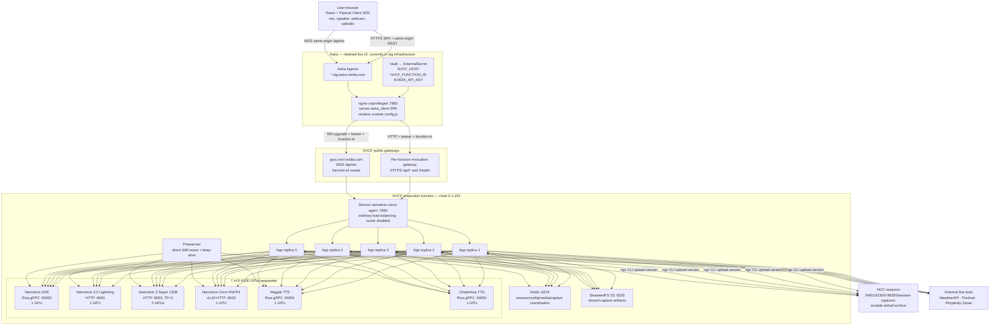
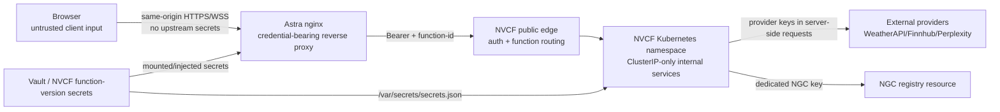
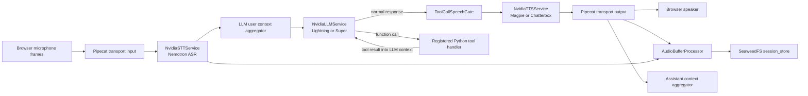
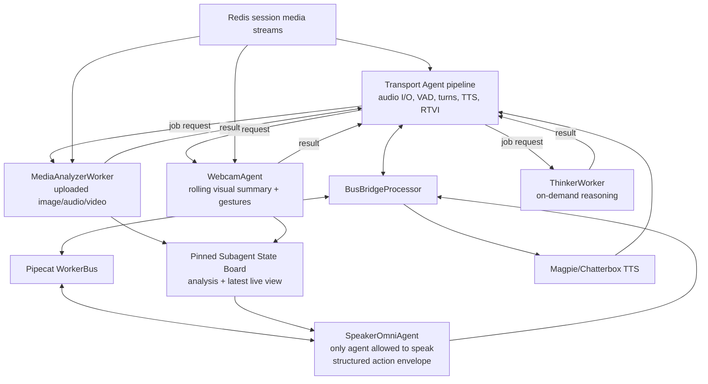
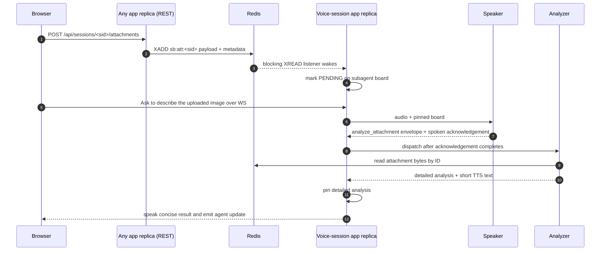
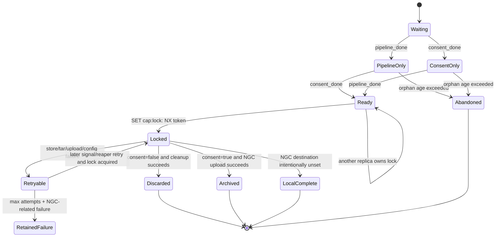
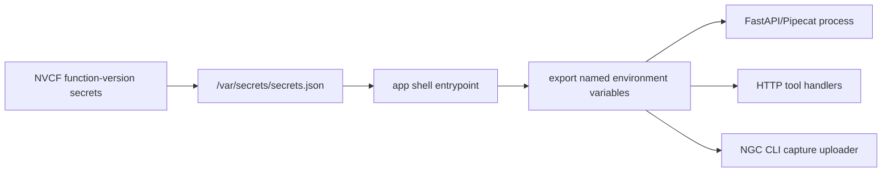
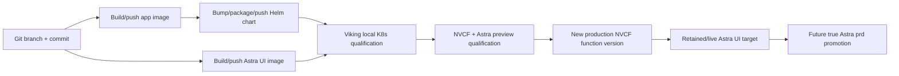
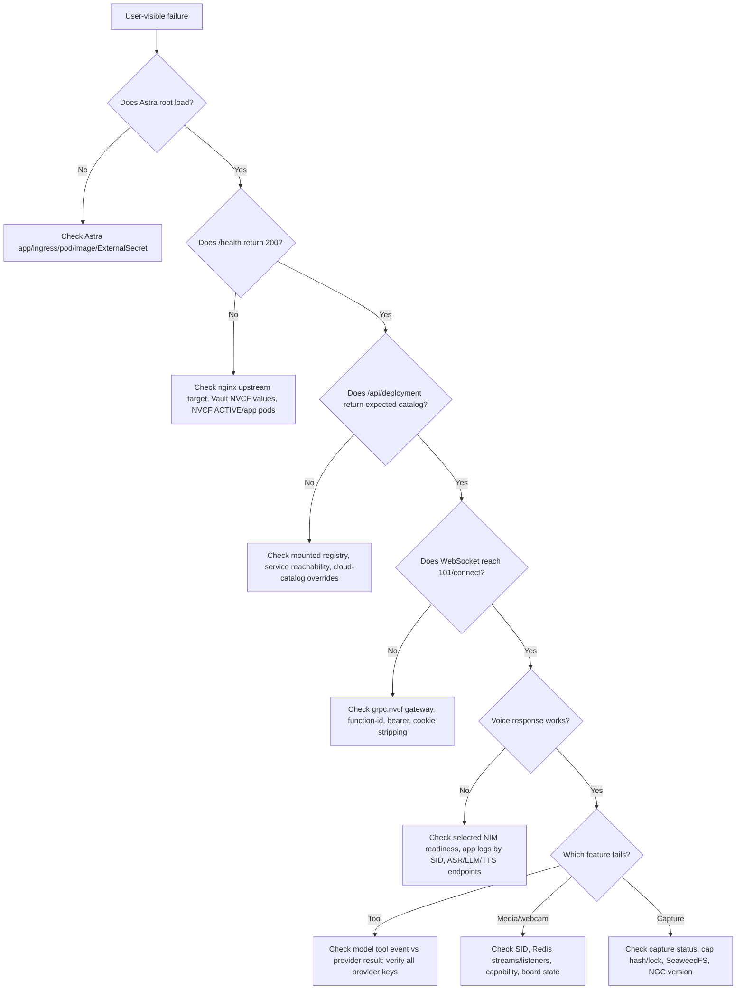

# Nemotron Voice Agent: Deployed Pipeline Architecture Snapshot

**Status:** historical deployment snapshot and candidate diary; not a live-state source

**Operational source:** use the
[Nemotron Voice Agent Operations skill](../skills/operate-nemotron-voice-agent/SKILL.md)
for durable architecture, deployment, SQA, incident, and risk knowledge. Query NVCF and
Astra before reporting current status, and keep exact candidate outcomes in versioned SQA
reports.

**Production snapshot verified:** August 25, 2026 (Asia/Kolkata)

**Isolated staging candidate verified:** August 27, 2026 (Asia/Kolkata)

**Deployed source branch/HEAD:** `dev/nikkulkarni/nvcf-deploy-rebased` / `21e353fe8ce3b83127abe6a8768053ada907f51b`

**Scope:** browser UI, Astra proxy, NVCF function, Helm workloads, Pipecat pipelines, model services, Redis, SeaweedFS, capture-to-NGC, concurrency, secrets, operations, and promotion

> This document distinguishes four kinds of claims:
>
> - **Live-verified** means the production qualification on August 25, 2026, returned the stated result.
> - **Rendered** means the result comes from chart `0.1.103` at the recorded deployed source HEAD.
>   The active NVCF function version reports this chart.
> - **Candidate** means a newer checked-in chart change that is not yet part of the
>   live-verified production snapshot.
> - **Historical** means the statement is preserved from qualification reports or chart history and is explicitly labelled as such.
>
> Never put secret values in this document. Credential names, ownership boundaries, and injection paths are safe to record; keys are not.

## Table of contents

1. [Executive summary](#1-executive-summary)
2. [Current environment truth](#2-current-environment-truth)
3. [System context and trust boundaries](#3-system-context-and-trust-boundaries)
4. [Component inventory and ownership](#4-component-inventory-and-ownership)
5. [Astra frontend and NVCF proxy](#5-astra-frontend-and-nvcf-proxy)
6. [NVCF function and Helm topology](#6-nvcf-function-and-helm-topology)
7. [Backend API and request routing](#7-backend-api-and-request-routing)
8. [Example and service selection](#8-example-and-service-selection)
9. [Generic Assistant pipeline](#9-generic-assistant-pipeline)
10. [Omni Assistant Subagents pipeline](#10-omni-assistant-subagents-pipeline)
11. [Concurrency and replica model](#11-concurrency-and-replica-model)
12. [Redis shared-state design](#12-redis-shared-state-design)
13. [SeaweedFS and session artifact storage](#13-seaweedfs-and-session-artifact-storage)
14. [Session capture and NGC publication](#14-session-capture-and-ngc-publication)
15. [Startup, readiness, prewarming, and health](#15-startup-readiness-prewarming-and-health)
16. [Secrets and credential flow](#16-secrets-and-credential-flow)
17. [Observability and operational evidence](#17-observability-and-operational-evidence)
18. [Failure modes and mitigations](#18-failure-modes-and-mitigations)
19. [Deployment, qualification, promotion, and rollback](#19-deployment-qualification-promotion-and-rollback)
20. [Operational verification runbook](#20-operational-verification-runbook)
21. [Troubleshooting decision tree](#21-troubleshooting-decision-tree)
22. [Configuration sources of truth](#22-configuration-sources-of-truth)
23. [Known limitations and open risks](#23-known-limitations-and-open-risks)
24. [Glossary](#24-glossary)

---

## 1. Executive summary

The retained experience is a two-platform system:

1. **Astra hosts a React single-page application behind a non-root nginx container.** The browser never receives NVCF credentials. nginx injects the NVCF bearer token and function ID into upstream HTTP and WebSocket requests.
2. **NVCF hosts the voice application and every inference service.** One Helm release creates five CPU application replicas, six GPU-backed inference deployments consuming seven H100 GPUs, Redis, SeaweedFS, and a prewarmer.
3. **The NVCF app entrypoint is a normal Kubernetes `Service`, not the parked nginx affinity router.** Requests are free to land on any app replica.
4. **A WebSocket voice session stays on the app process that accepted that socket.** Redis does not migrate a live pipeline between pods. Redis makes the REST side of the same session—session config, attachments, webcam frames, capture consent, capture requests—visible to any replica.
5. **Redis and SeaweedFS solve different concurrency problems.** Redis carries small live coordination/configuration and media streams; SeaweedFS is the shared S3-compatible staging store for capture artifacts. Both are required for replica-safe session capture.
6. **Session capture is entirely in the app process.** Pipeline teardown and browser consent are independent signals recorded in Redis. Exactly one replica wins a token-owned lock, reads artifacts from SeaweedFS, builds a tarball, and publishes an NGC resource version named with the session ID.
7. **The two selectable experiences are Generic Assistant and Nemotron Omni Assistant Subagents.** Generic is a cascaded ASR → text LLM → tools → TTS pipeline. Omni uses an audio-capable model plus a Pipecat worker bus with Speaker, Media Analyzer, Webcam, and Thinker roles, followed by external TTS.
8. **Production remains active, and an isolated `-2` staging candidate is also deployed.** The retained live UI still targets production. The separate `nemotron-voice-agent-2` NVCF function and `nemotron-voice-agent-2-deploy` Astra app host rejected candidate `0.1.115` for remediation and requalification. Neither Astra app is a true Astra `prd` deployment.

### 1.1 One-screen architecture



> The prewarmer currently has direct warm targets for ASR, Super, Omni, Magpie, and Chatterbox. The rendered template does **not** include a Lightning LLM warm call even though Lightning is enabled. This is a real coverage gap, not a diagram omission.

---

## 2. Current environment truth

### 2.1 Live-verified deployment snapshot

| Item | Current value | Evidence class |
|---|---|---|
| NVCF function name | `nemotron-voice-agent` | Live-verified |
| NVCF function ID | `81862ff8-4931-4f1e-9655-caa5b0bc5911` | Live-verified |
| Active function version | `453e2bce-d59b-4683-9d20-74e56c021003` | Live-verified |
| NVCF state | `ACTIVE` | Live-verified |
| NVCF backend | `nvcf-dgxc-k8s-oci-nrt-prd12-1` | Live-verified |
| NVCF instance type | `OCI.GPU.H100_8x` / `H100` | Live-verified |
| NVCF scale | min `1`, max `1` instance | Live-verified |
| NVCF max request concurrency | `100` | Live-verified; platform setting, not a proof of end-to-end capacity |
| Helm chart | `nemotron-voice-agent:0.1.103` | Live-verified |
| App image | `nvcr.io/0491162300748285/nemotron-voice-agent:2.0.32` | Rendered from active chart |
| Astra app | `nemotron-voice-agent-deploy` | Checked-in deployment identity and prior live Fusion verification |
| Astra URL | `https://nemotron-voice-agent-deploy-backend.stg.astra.nvidia.com` | Live-verified: root, `/health`, and `/api/deployment` returned `200` |
| Astra UI image | `artifactory.nvidia.com/it-astra-docker-local/nemotron-voice-agent/nemotron-voice-agent-ui:21de471` | Checked-in retained values |
| UI build timestamp | `2026-08-18T07:37:09Z` | Live-verified from `/config.js` |
| Astra infrastructure environment | `stg`, cluster/role path `astrastg01-ocp-pdx04` | Checked-in values |
| Astra preview | removed; former preview DNS no longer resolved | Live-verified |
| NVCF staging | isolated `nemotron-voice-agent-2` candidate is active; see [Isolated Staging Candidate](#22-isolated-staging-candidate) | Live-verified |
| Capture status | enabled, consent required, S3 backend, dedicated NGC key present, `pending_sessions=0`, no pending errors | Live-verified |

### 2.2 Isolated Staging Candidate

The following environment is isolated from the retained live UI and production
function. Candidate `0.1.115` is **rejected** and must not be promoted.

| Item | Candidate value | Evidence class |
|---|---|---|
| NVCF function name | `nemotron-voice-agent-2` | Live-verified |
| NVCF function ID | `7886e141-cf95-4de5-9707-84cdfe048ddf` | Live-verified |
| Function version | `f9c31ddc-dabd-42b4-b4b6-7c9bcf52e38d` | Live-verified |
| NVCF state | `ACTIVE` | Live-verified |
| NVCF backend | `nvcf-dgxc-k8s-oci-nrt-prd9-1` | Live-verified |
| NVCF deployment ID | `388ede61-5e92-4b76-bab1-b51bad1d82ff` | Live-verified |
| Helm chart / app | `0.1.115` / `2.0.44` | Live-verified |
| Candidate source | `74dc76e1` | Rendered from active chart |
| Astra app | `nemotron-voice-agent-2-deploy` | Live-verified |
| Astra URL | `https://nemotron-voice-agent-2-deploy-backend.stg.astra.nvidia.com` | Live-verified |
| Astra UI timestamp | `2026-08-26T07:10:38Z` | Live-verified from `/config.js` |
| Candidate decision | **REJECTED** | Strict repeated-tool matrix failed |

The complete real-audio browser suite passed before the blocking concurrency
gate. Its Generic phase produced audio on 15 of 15 turns and selected every
expected tool. Omni voice, image upload, webcam grounding, UI behavior, capture
status, and eight mixed concurrent sessions also passed.

The stricter eight-client by ten-turn `EXPECT_TOOL` matrix completed all 80
turns, produced bot audio for all 80, and observed no silent turns, console
errors, or WebSocket closures. It still failed 10 turns:

- An explicit Toronto weather repeat delegated `Pune`, which violated session
  grounding and counted as one cross-talk turn in the harness. This result does
  not prove that Redis leaked state between sessions.
- All eight synchronized follow-up turns reached the 15-second Super planner
  boundary. The following repeat turns succeeded, so this is a transient
  saturation and latency failure, not a permanent routing outage.
- One later correct Boston response failed only because the independent SQA
  transcription request returned HTTP 403. This oracle failure does not clear
  the nine product failures.

The remediation keeps Lightning responsible for choosing direct speech,
`call_backend`, or `cancel_backend`. It does not add an intent router. Promotion
requires a fresh immutable candidate and a clean rerun of the blocking matrix.

The active isolated staging environment remains on rejected candidate
`0.1.115`. Candidate `0.1.116` ran only on Viking and was also rejected.
Chart `0.1.120` with app/UI `2.0.49` passed its strict repeated-tool matrix and
automated exact-pronunciation probe. Chart `0.1.122` with app/UI `2.0.51` was
built and pushed, but it was not deployed or qualified. Chart `0.1.123` keeps
app/UI `2.0.51` and updates the two TTS NIMs. It is not built or qualified.
The active isolated
`-2` environment remains on rejected candidate `0.1.115`, and no candidate has
staging or production approval.

### 2.3 Important Naming Truth: “Live/Prod” Versus Astra `prd`

The retained UI is called the production app in project operations, and it points to the production NVCF function. It is **not yet an Astra production-environment deployment**.

```text
Current:
  Astra stg cluster + stg ingress + stg Vault path
      → retained live UI
      → production NVCF function

Target:
  Astra prd cluster + prd ingress + prd Vault path
      → production UI
      → production NVCF function
```

The checked-in retained values explicitly contain:

- `fusionv12.environment: stg`
- `project.deploymentEnv: stg`
- hostname suffix `.stg.astra.nvidia.com`
- JWT path `jwt/astrastg01-ocp-pdx04/`
- Vault role ending `-stg`
- shared secret path ending `/stg`

A true Astra production promotion requires a production deployment on `astraprd01-ocp-pdx04`, a production Vault path, generated production ingress/role values, and an NSPECT ID. Do not remove the retained live `stg` app until the `prd` app is deployed and qualified.

### 2.4 Live Feature Advertisement

`GET /api/deployment` currently advertises:

| Example | Models | ASR | TTS | Capabilities |
|---|---|---|---|---|
| Generic Assistant | Nemotron 3.5 Lightning; Nemotron 3 Super 120B | Nemotron ASR Streaming English | Magpie; Chatterbox Multilingual | tool selection |
| Nemotron Omni Assistant Subagents | Nemotron 3 Nano Omni 30B A3B Reasoning NVFP4 | internal to Omni audio model | Magpie; Chatterbox Multilingual | attachments, webcam |

Only WebSocket transport is advertised in the NVCF deployment.

---

## 3. System context and trust boundaries

### 3.1 Trust boundaries



Security implications:

- The browser can inspect the public SPA and `config.js`, but `config.js` contains only non-secret demo settings and the deployment timestamp.
- The Astra nginx process renders the NVCF bearer credential into its private nginx configuration at container startup. The value is not emitted into browser JavaScript.
- NVCF secrets arrive as `/var/secrets/secrets.json`, not Kubernetes `Secret` environment references. The app entrypoint exports named values before starting Python.
- Redis and SeaweedFS have no ingress. Their present authentication posture relies on namespace/network isolation. Redis allows an empty password; SeaweedFS does not enforce S3 identities in the current template.
- Session IDs are server-generated 12-character hex strings. Capture paths sanitize again to a hex-only maximum of 32 characters before any file/object key use.

### 3.2 NVCF constraints that shaped the design

- Only the function’s declared app port `7860` is externally reachable. Internal NIM, Redis, and SeaweedFS ports are not public.
- Browser WebSockets must use the NVCF streaming gateway. The per-function HTTP invocation endpoint strips or does not preserve the required upgrade behavior.
- NVCF function secrets are mounted as JSON and must be re-supplied for every function version.
- NVCF’s zone-locked RWO OCI block volumes cannot safely provide an RWX shared filesystem to five app replicas and caused fresh-AZ `ContainerCreating` stalls historically.
- The session-affinity router required a StatefulSet-backed stable-pod-DNS topology that repeatedly failed NVCF deployment. The router remains parked.
- Older sidecar-based capture designs were not operationally observable/reliable on NVCF and required unavailable Kubernetes API behavior. Capture moved into the app process.

---

## 4. Component inventory and ownership

### 4.1 Runtime ownership matrix

| Component | Runs in | Replica/GPU shape | Owns | Does not own |
|---|---|---:|---|---|
| `astra_client` React SPA | browser | per browser | UX, example/model/voice/tool selection, mic/camera, transcript, consent | secrets, pipeline execution |
| Astra nginx UI container | Astra | 1 CPU pod | SPA serving, HTTP/WS reverse proxy, auth/header injection, runtime `config.js` | agent logic, model inference |
| NVCF public gateways | NVIDIA managed edge | managed | authentication, function routing | application session state |
| `nemotron-voice-agent` service | NVCF namespace | one ClusterIP | distributing new requests across app pods | sticky affinity |
| FastAPI/Pipecat app | NVCF | 5 CPU pods | API, per-WebSocket pipeline, example dispatch, tools, capture finalize | model weights, durable archive |
| Redis | NVCF | 1 CPU pod | live shared config/media, capture flags/locks | durable storage |
| SeaweedFS | NVCF | 1 CPU pod | shared S3-compatible capture staging | long-term durability |
| ASR NIM | NVCF | 1 pod / 1 GPU | streaming English speech recognition | LLM/TTS |
| Lightning NIM | NVCF | 1 pod / 1 GPU | Generic default text LLM and tool choice | external tool execution |
| Super NIM | NVCF | 1 pod / 2 GPUs | selectable Generic text LLM | ASR/TTS |
| Omni vLLM | NVCF | 1 pod / 1 GPU | Omni audio understanding, speaking policy, visual/media/thinker inference | external audio synthesis |
| Magpie TTS NIM | NVCF | 1 pod / 1 GPU | default synthesis | ASR/LLM |
| Chatterbox TTS NIM | NVCF | 1 pod / 1 GPU | selectable synthesis, chunk-limited | ASR/LLM |
| Prewarmer | NVCF | 1 CPU pod | warm/keep-alive direct model paths | user sessions |
| NGC session resource | NGC | managed | durable versioned session archives | live state |
| External tool APIs | internet/NVIDIA gateway | managed | current weather, stock quote, web result | conversation orchestration |

### 4.2 GPU allocation

| Workload | GPUs |
|---|---:|
| Nemotron ASR Streaming | 1 |
| Nemotron 3.5 Lightning | 1 |
| Nemotron 3 Super 120B, tensor parallel 2 | 2 |
| Nemotron Omni NVFP4 | 1 |
| Magpie TTS | 1 |
| Chatterbox TTS | 1 |
| **Total requested** | **7 of 8 H100s** |

The unused eighth GPU is capacity headroom, not a separately deployed service.

---

## 5. Astra frontend and NVCF proxy

### 5.1 UI implementation

The dedicated demo UI lives in `astra_client/`, separate from the upstream-style `client/`. It is:

- React + TypeScript built with Vite.
- Driven by the Pipecat Client SDK and `@pipecat-ai/websocket-transport`.
- Built in the first stage of `docker/Dockerfile.nvcf-ui`.
- Served by `nginxinc/nginx-unprivileged:alpine` on port `7860`.
- OpenShift-compatible: non-root execution, group-0 writable nginx and web roots.
- Curated to Generic Assistant and Omni Assistant Subagents by runtime demo settings and backend advertisement.

The browser calls same-origin paths only. This avoids CORS and, more importantly, lets the server-side proxy add credentials that browser WebSocket APIs cannot set.

### 5.2 Proxy route split

| Browser path | Astra nginx upstream | Why |
|---|---|---|
| `/` and static files | local `/usr/share/nginx/html` | React SPA |
| `/api/ws` | `https://grpc.nvcf.nvidia.com` with WebSocket upgrade | NVCF streaming gateway preserves long-lived WS |
| `/api/*`, `/health` | `https://${NVCF_HOST}` | per-function HTTP invocation gateway |
| `/feedback` | configured external form URL | optional server-side proxy; upstream URL remains private |

For both NVCF upstreams nginx adds:

- `Authorization: Bearer ${NVIDIA_API_KEY}`
- `function-id: ${NVCF_FUNCTION_ID}`

It also strips incoming `Cookie` and hides upstream `Set-Cookie`. This prevents an old `nvcf-request-id` affinity/resume cookie from surviving a function rollover and producing a dead-session `404`/WebSocket `1006` on a later connection.

### 5.3 Runtime UI configuration

The container entrypoint generates `config.js` with:

- build/deployment timestamp,
- demo mode,
- session duration,
- visible example keys,
- self-hosted-only flag,
- capture/record flag.

`NVIDIA_API_KEY`, `NVCF_HOST`, `NVCF_FUNCTION_ID`, and feedback upstream URL are not written to this browser-readable file.

### 5.4 Browser start-session sequence

```mermaid
sequenceDiagram
    autonumber
    participant User
    participant React as React/Pipecat client
    participant Nginx as Astra nginx
    participant HTTP as NVCF HTTP gateway
    participant AppA as App replica A
    participant Redis
    participant WS as NVCF WS gateway
    participant AppB as App replica B

    User->>React: Select example/model/ASR/TTS/tools and Start
    React->>React: Build sanitized SessionConfig body
    React->>Nginx: POST /api/session-config
    Nginx->>HTTP: Add Bearer + function-id
    HTTP->>AppA: Load-balanced REST request
    AppA->>AppA: Sanitize + hydrate catalog + readiness checks
    AppA->>Redis: SET sb:cfg:<sid> with TTL
    AppA-->>React: {session_id}
    React->>Nginx: WSS /api/ws?session_id=<sid>
    Nginx->>WS: Upgrade + Bearer + function-id; strip cookies
    WS->>AppB: Load-balanced WebSocket
    AppB->>Redis: GET sb:cfg:<sid>
    AppB->>AppB: Resolve selected example bot and create one pipeline
    AppB-->>React: Pipecat/RTVI frames and audio
```

The REST and WebSocket requests may hit different pods by design. Redis closes that gap.

---

## 6. NVCF function and Helm topology

### 6.1 Rendered workloads

Chart `0.1.103` renders ten `Deployment` objects:

1. five-replica application deployment,
2. ASR,
3. Chatterbox TTS,
4. Lightning LLM,
5. Super LLM,
6. Omni vLLM,
7. prewarmer,
8. Redis,
9. SeaweedFS,
10. Magpie TTS.

It renders ClusterIP services for the app, ASR, both LLM families, Omni, Redis, SeaweedFS, and both TTS services. Ingress is disabled inside NVCF; exposure is through the NVCF function gateway.

### 6.2 Workload images

| Workload | Image |
|---|---|
| app and prewarmer | `nvcr.io/0491162300748285/nemotron-voice-agent:2.0.32` |
| ASR | `nvcr.io/0491162300748285/nemotron-asr-streaming:1.2.0` |
| Lightning | `nvcr.io/nim/nvidia/nemotron-3.5-lightning-30b-a3b:2.0.9-variant` |
| Super | `nvcr.io/nim/nvidia/nemotron-3-super-120b-a12b:2.0.5` |
| Omni | `nvcr.io/0491162300748285/vllm-omni:v0.20.0-cu130-r2` |
| Magpie | `nvcr.io/0491162300748285/magpie-tts-multilingual:1.8.0` |
| Chatterbox | `nvcr.io/nim/nvidia/chatterbox-tts-multilingual:1.0.0` |
| Redis | `nvcr.io/0491162300748285/redis:7.2.4-debian-12-r12` |
| SeaweedFS | `nvcr.io/0491162300748285/seaweedfs:4.41` |

### 6.3 Entrypoint and internal DNS

NVCF targets:

- chart service: `nemotron-voice-agent`
- inference URL: `/api/ws`
- inference port: `7860`
- health URI: `/health`
- health port/protocol: `7860` / HTTP

Internal fixed service names form the runtime contract:

| Service | Endpoint | Consumer |
|---|---|---|
| `nemotron-voice-agent` | `:7860` | NVCF edge |
| `nemotron-asr-streaming-english` | gRPC `:50052`, health `:9001` | Generic app/prewarmer |
| `nemotron-lightning` | HTTP `:8000/v1` | Generic app |
| `nemotron-3-super` | HTTP `:8000/v1` | Generic app/prewarmer |
| `nvidia-llm-vllm-omni` | HTTP `:8002/v1` | Omni workers/prewarmer |
| `tts-service` | gRPC `:50051`, health `:9000` | both examples/prewarmer |
| `chatterbox-tts-service` | gRPC `:50051`, health `:9000` | both examples/prewarmer |
| `redis` | `:6379/0` | all app replicas |
| `seaweedfs` | S3 API `:8333` | all app replicas |

#### 6.3.1 Omni Model Name Contract

**Deployed (chart `0.1.103`):** The Omni vLLM deployment separates the model
repository from the model name that clients use:

- `omni.model` identifies the Hugging Face repository that vLLM downloads.
- `omni.servedModelName` defines the stable OpenAI-compatible model name that
  vLLM advertises through `/v1/models`.

The chart passes `omni.servedModelName` to vLLM with
`--served-model-name`. The prewarmer sends the same name in its chat-completion
request. Keep this value equal to the `model_id` in
`src/examples/omni_assistant_subagents/services.local.yaml`.

This separation lets you change the repository or quantization artifact without
changing the application-facing model name. If the advertised name and catalog
`model_id` differ, vLLM returns `404` before the initial Omni greeting completes.

Candidate chart `0.1.113` preserves this deployed model-name contract.

### 6.4 Request balancing

The chart has no session-affinity router. The application always runs as a
`Deployment`, and the fixed `nemotron-voice-agent` Service selects application pods.

- New HTTP and WebSocket requests use ordinary Kubernetes load balancing.
- No session-consistent hash occurs at the chart layer.
- Redis shares live session and media state across replicas.
- SeaweedFS shares session-capture artifacts across replicas.

No dormant router, StatefulSet, or headless Service templates remain in the chart.

---

## 7. Backend API and request routing

### 7.1 API surface

| Route | Method/protocol | Purpose |
|---|---|---|
| `/health` | GET | shallow app liveness/readiness |
| `/api/deployment` | GET | visible examples, defaults, capabilities, transports |
| `/api/prompts` | GET | example-local prompt catalog |
| `/api/tools` | GET | example-local tool schemas |
| `/api/subagents` | GET | subagent registry for UI |
| `/api/services` | GET | reachable service catalog |
| `/api/tts-config` | GET | languages/voices and optional ASR/TTS intersection |
| `/api/session-config` | POST | validate/store a configuration and mint a session ID |
| `/api/ws` | WebSocket | Pipecat RTVI voice transport used in NVCF |
| `/api/start`, `/api/offer` | POST/PATCH | WebRTC bootstrap/signaling; not advertised on NVCF |
| `/v1/realtime` | WebSocket | OpenAI-Realtime-shaped compatibility gateway; not proxied explicitly by the Astra NVCF nginx template and not part of the curated path |
| `/api/sessions/{sid}/attachments` | POST | image/audio/video upload, capability gated |
| `/api/sessions/{sid}/webcam/frames` | POST | low-resolution webcam frame upload |
| `/api/sessions/{sid}/webcam/capture` | POST | consume a valid high-resolution capture request and store the image |
| `/api/webcam-config` | GET | browser sampling defaults |
| `/api/session-capture` | POST | consent decision and transcript at teardown |
| `/api/session-capture/status` | GET | capture readiness and pending/error counts |

### 7.2 Session config resolution

`POST /api/session-config` performs this order:

1. parse JSON;
2. choose the requested example, constrained by the visible registry;
3. add the example’s default prompt when neither prompt key nor custom prompt is present;
4. filter unknown session fields;
5. hydrate built-in model/service IDs from the example-local catalog;
6. verify selected local LLM, ASR, and TTS readiness;
7. mint `uuid4().hex[:12]`;
8. store an in-process fast-path copy and persist the same config to Redis with TTL;
9. return the short session ID.

When `/api/ws?session_id=...` lands elsewhere, the target pod checks its local dict first, then Redis. Query parameters can override stored values before the result is sanitized again.

### 7.3 Capability enforcement

Attachment and webcam endpoints resolve the session config and inspect the selected example’s declared capabilities. A Generic session receives `403` for Omni-only media operations. Unknown sessions receive `404`. Upload bodies are bounded at 50 MiB; webcam frames have an additional 5,000,000-byte bound. Uploaded images must pass extension and JPEG/PNG magic-byte checks.

---

## 8. Example and service selection

### 8.1 Sources of selection truth

There are two registry layers:

- root `examples_registry.yaml` is the general source registry for all examples;
- the NVCF Helm `ConfigMap` mounts a curated registry over `/app/examples_registry.yaml` exposing exactly Generic and Omni Subagents plus every enabled compatible model/voice.

Runtime environment pins:

- `EXAMPLE_SELECTION=all`
- `TRANSPORT_SELECTION=websocket`
- `PLATFORM=workstation`
- `APP_RUNTIME=container`
- `disableCloudServices=true`, which mounts empty cloud catalogs over all example packages.

The `workstation` catalog is intentionally used inside Kubernetes because its endpoints are in-cluster service DNS names. “Workstation” here means catalog namespace, not physical deployment location.

### 8.2 Reachability and hydration

Service metadata is loaded from each example’s `services.local.yaml`. Built-in IDs are resolved to model IDs, base URLs, gRPC servers, voices, function IDs, and extra parameters. Local endpoints are filtered/checked for reachability before sessions begin. UI selections send stable service IDs; the backend fills the detailed connection values.

This keeps the browser from inventing internal DNS endpoints and permits the same React client to run against different catalogs.

---

## 9. Generic Assistant pipeline

### 9.1 Framework and graph

Generic Assistant is a **Pipecat cascaded voice pipeline**, not a React agent and not an external agent framework such as LangGraph. React is only the client. Agentic behavior is provided by an OpenAI-compatible NVIDIA LLM with Pipecat function calling.



Actual processor order:

```text
transport.input
→ NvidiaSTTService
→ user context aggregator
→ NvidiaLLMService
→ ToolCallSpeechGate
→ NvidiaTTSService
→ transport.output
→ optional activity checker
→ optional audio recorder
→ assistant context aggregator
```

### 9.2 System prompt structure

The deployed prompt `generic_assistant` combines:

1. identity and friendly voice-assistant behavior;
2. routing policy for current weather, forecast, stock, and all other current facts;
3. anti-hallucination requirements for live data;
4. narrow use rules for BMI and random-number tools;
5. speech-format constraints: one short sentence, no markdown/lists/special formatting;
6. a tool-result exception allowing a longer exact result.

The default tools selected by that prompt are:

- `calculate_bmi`
- `generate_random_number`
- `web_search`
- `get_weather`
- `get_stock_price`

The UI can override this per session with a comma-separated allowlist or `none`. The backend intersects requested names with registered handlers before it advertises schemas to the model.

### 9.3 Tool call implementation

For each allowed tool:

1. `tools.yaml` supplies an OpenAI-style JSON function schema;
2. `build_tools_schema` rejects missing/mismatched/unhandled entries;
3. `NvidiaLLMService.register_function` binds the schema name to a Python async handler;
4. the model emits a function call under `tool_choice=auto`;
5. Pipecat invokes the handler with `FunctionCallParams`;
6. the handler returns structured output through `result_callback`;
7. the LLM receives the result and generates the user-facing answer;
8. `on_function_calls_started` emits an RTVI `tool-call` event for the UI.

### 9.4 Live providers and error policy

| Tool | Provider | Key | Failure behavior |
|---|---|---|---|
| `get_weather` | WeatherAPI `/current.json` | `WEATHERAPI_KEY` | friendly unavailable object; never fake weather |
| `get_stock_price` | Finnhub symbol search + quote | `FINNHUB_API_KEY` | friendly unavailable or not-found; never fake price |
| `web_search` | Perplexity Sonar via NVIDIA inference gateway | `PERPLEXITY_API_KEY` | retries transient 429/5xx/transport once, then friendly unavailable |
| `calculate_bmi` | local Python | none | validates numeric/positive inputs |
| `generate_random_number` | local Python | none | validates integer range |

Raw provider exceptions/status codes are not returned as spoken tool output. This prevents TTS from reading operational errors aloud.

### 9.5 Speech and reasoning safeguards

- `ToolCallSpeechGate` buffers a completion and drops all text if the same completion contains a tool call. This stops reasoning text or “let me check” filler from reaching TTS; only the post-tool-result answer is spoken.
- `NemotronSpeechTextFilter` removes characters reserved by the TTS preprocessor.
- Chatterbox uses a length-limited aggregator (`max_tts_chunk_chars=240`) to avoid overlong synthesis requests.
- The client’s Reasoning toggle writes `extra_body.chat_template_kwargs.enable_thinking` into `extra_params`.
- Lightning’s catalog default has reasoning enabled because live qualification found better tool adherence in that mode.

### 9.6 Context and lifecycle

- Initial context contains the selected prompt plus optional model-level system prompt.
- Chat history keeps recent turns and uses pinned-prompt summarization after assistant turns.
- The user/bot latency observer emits metrics over RTVI.
- On client disconnect, the pipeline is cancelled.
- Capture finalization waits for `on_pipeline_finished`, after the cancellation frame reaches the end and the audio recorder flushes.

### 9.7 Generic Frontend/Backend Progress Speech and Barge-In

The selected Generic Frontend/Backend experience owns progress speech in code.
It ignores model-authored filler and emits at most one delayed phrase while
delegated work remains active. The capability-specific phrases are:

| Capability | Progress Speech |
|---|---|
| Weather or forecast | “Let me check the latest weather.” |
| Stock or share price | “Let me look up the latest price.” |
| Web search, news, or research | “Let me look that up.” |

The Astra WebSocket client handles audible barge-in through these independent
paths:

1. The public user-speaking callback calls
   `DailyMediaManager.userStartedSpeaking()` and clears buffered browser audio.
2. The raw protobuf interruption frame remains a compatibility no-op because
   the generated client schema does not expose that field.
3. A transparent server `BargeInTracker` records whether the user started while
   bot speech was active. It forwards every frame unchanged and does not stop
   browser playback itself.
4. An explicit cancellation after speech-only interruption returns “Okay, I
   stopped that,” even when no delegated backend task is active.
5. A turn such as “Wait, stop. What is two plus two?” remains a substantive
   replacement. The Talker answers or delegates it instead of returning a
   cancellation-only response.

“There is nothing pending right now” is reserved for an explicit cancellation
when there is no active backend task, pending domain work, or interrupted bot
speech.

---

## 10. Omni Assistant Subagents pipeline

### 10.1 Framework and agent model

Omni Subagents uses Pipecat’s built-in `pipecat.workers` framework:

- one `WorkerRunner`,
- one shared `WorkerBus`,
- multiple `PipelineWorker` instances,
- a `BusBridgeProcessor` in the transport pipeline.

It is a real multi-worker agent design within one app process/session. It is not a React agent. React carries audio/media and renders state; the Python worker graph owns agent decisions.

### 10.2 Worker architecture



### 10.3 Transport Agent graph

```text
transport.input
→ mute-until-first-bot-completes
→ Silero VAD
→ user-turn processor
→ BusBridgeProcessor
→ PostAckMediaDispatchProcessor
→ NvidiaTTSService
→ transport.output
→ optional audio recorder
→ assistant aggregator
```

The transport worker owns all physical audio and TTS. User frames are bridged to the Speaker worker; the Speaker’s response frames return through the same bridge into TTS.

### 10.4 Speaker action envelope

The Speaker’s model response is a strict JSON object with ordered fields:

```json
{
  "transcript": "verbatim audio transcript",
  "turn_action": "respond|think|analyze_attachment|capture_highres|clarify",
  "response": "spoken response or short acknowledgement",
  "selected_input_source": "uploaded_attachment|none",
  "media_analysis_action": "new|rerun|none",
  "media_analysis_prompt": "self-contained uploaded-file task or empty",
  "highres_query": "specific live capture question or empty"
}
```

The implementation incrementally parses JSON fields so it can stream the `response` field only after a valid action is known. Malformed/contradictory envelopes receive one bounded self-correction. If correction fails, the turn falls back to the Thinker. Prompt artifacts and verbatim repetitions are filtered before TTS.

### 10.5 Ownership policy

| Action | Owner | Effect |
|---|---|---|
| `respond` | Speaker | complete the task immediately |
| `clarify` | Speaker | ask one precise question; queue nothing |
| `analyze_attachment` | Media Analyzer | acknowledge, then dispatch after acknowledgement closes |
| `capture_highres` | browser capture + Media Analyzer | request a validated one-shot native-resolution frame immediately, then analyze |
| `think` | Thinker | acknowledge and queue a reasoning-on re-answer |

The prompt explicitly prevents the visionless Thinker from handling live-visual disputes. Low-resolution live view and uploaded files are kept as separate sources. A pending upload becomes the referent for “this image/it”; after analysis, it becomes past context and the webcam returns to default visual focus.

### 10.6 Uploaded media sequence



### 10.7 Webcam sequence

The browser uploads compressed frames according to `/api/webcam-config` defaults: one-second sampling, 640-pixel maximum width, JPEG quality `0.7`, and an initial upload after roughly 700 ms. Frames enter a Redis stream capped to an approximate ring of 64 entries.

The voice-session replica registers a cross-pod Redis stream listener. Fresh frames wake the Webcam Controller, which dispatches recent frames to the Webcam worker. The worker creates a short temporal video window, asks Omni for a strict JSON observation/gesture classification, and updates the pinned board. The Speaker re-reads the latest live-view note on each turn.

Supported conservative gesture intents are wave/greet, open-palm stop, thumbs-up continue, and thumbs-down feedback. A stop gesture queues an interruption frame through the same pipeline path as voice barge-in.

### 10.8 High-resolution capture handshake

1. low-resolution view cannot reliably resolve printed text/details;
2. Speaker offers a high-resolution snapshot without capturing yet;
3. user agrees on a later turn;
4. Speaker emits `capture_highres` plus a specific query;
5. server creates one random capture request ID in Redis;
6. RTVI tells the browser to capture;
7. browser POSTs image plus request ID;
8. server atomically consumes the matching request using compare-and-delete Lua;
9. image is stored as a capture-source attachment;
10. Media Analyzer performs one-shot analysis and removes the capture attachment afterward.

---

## 11. Concurrency and replica model

### 11.1 What is horizontally scaled

- Five FastAPI/Pipecat application pods accept independent sessions.
- Kubernetes/NVCF distributes new HTTP and WebSocket connections across those pods.
- Each accepted WebSocket creates a separate pipeline/worker graph and context in that process.
- Multiple sessions on one pod are asynchronous Python tasks; five pods add process/pod isolation and CPU capacity.

### 11.2 What is shared, and what is not

| State/data | Location | Cross-pod? | Lifetime |
|---|---|---:|---|
| active WebSocket and pipeline processors | app process | no | socket/session |
| LLM conversation context | app process | no | socket/session |
| sanitized session config | local dict + Redis | yes | Redis TTL 3600 s |
| attachments/webcam bytes | Redis Streams | yes | TTL 3600 s / ring-limited |
| capture request token | Redis key | yes | TTL 3600 s |
| capture flags/attempts | Redis hash | yes | capture TTL 3600 s |
| finalize lock | Redis key | yes | 900 s |
| capture audio/log/transcript | SeaweedFS S3 | yes | until upload/cleanup or store restart |
| NGC tarball | NGC resource version | yes/durable | registry retention |

Redis makes **ancillary requests** replica-independent. It does not make a live WebSocket movable. If the pod holding the socket dies, that live session ends and the client must reconnect.

### 11.3 End-to-end concurrency limits

The NVCF deployment setting `maxRequestConcurrency=100` is only the edge admission setting. Practical capacity is also bounded by:

- five app replicas and per-pod event-loop load;
- single ASR, Lightning, Super, Omni, Magpie, and Chatterbox service replicas;
- model server sequence/KV settings;
- Omni `maxNumSeqs=4`;
- Redis 256 MiB maxmemory and media payload size;
- SeaweedFS single-pod throughput;
- external provider quotas;
- four-thread capture finalize executor per app process;
- browser/audio behavior and response latency.

Capacity must therefore be established by SQA/concurrency tests, not inferred from `100`.

### 11.4 Rollout behavior

With the router disabled, the app `Deployment` uses `strategy: Recreate` because WebSocket sessions are stateful per process. A same-version in-place chart rollout can interrupt active calls. The safer managed pattern is a new immutable NVCF function version, qualify it, then cut over/remove the old deployment.

---

## 12. Redis shared-state design

### 12.1 Deployment

- one Bitnami Redis `Deployment`;
- ClusterIP-only service `redis:6379`;
- no AOF and no RDB snapshots;
- `maxmemory 256mb` with `allkeys-lru`;
- readiness/liveness via `redis-cli ping`;
- empty password inside the cluster;
- intended to be ephemeral because active sessions can reconnect.

### 12.2 Key map

| Key pattern | Type | Meaning |
|---|---|---|
| `sb:cfg:<sid>` | string JSON | sanitized session config |
| `sb:wc:<sid>` | stream | webcam frame metadata + bytes |
| `sb:seq:wc:<sid>` | integer | webcam sequence |
| `sb:att:<sid>` | stream | attachment metadata + bytes |
| `sb:seq:att:<sid>` | integer | attachment sequence |
| `sb:capreq:<sid>` | string | only valid high-resolution request ID |
| `cap:<sid>` | hash | `pipeline_done`, `consent_done`, consent, transcript flag, attempts, last error, update time |
| `cap:lock:<sid>` | string | finalize owner token |

### 12.3 Startup behavior

The Python client retries Redis connection for a bounded 30-second window and otherwise falls back to in-memory mode. Because such a fallback is unsafe at five replicas, the NVCF shell entrypoint now blocks indefinitely on `PING` before Python starts whenever `REDIS_URL` is configured. This turns a silent partial failure into a visible pod-start dependency.

### 12.4 Cross-pod notification

Attachment and webcam listeners use blocking `XREAD`:

- start cursor is `0`, so data written before listener startup is not missed;
- block interval is 5000 ms;
- socket timeout is 15 s, intentionally greater than block time;
- idle socket timeout is treated as an empty read;
- Redis/network errors retry with bounded exponential backoff;
- callback errors do not kill the listener.

### 12.5 Redis outage behavior

- A Redis restart loses active session config, media, capture flags, and locks because persistence is disabled.
- Existing WebSocket pipelines may keep processing voice from in-process context, but new REST operations and cross-pod media/config resolution can fail.
- The listener loop recovers from transient read errors, but most synchronous store operations surface Redis errors to their caller rather than transparently switching mid-session to local memory.
- Capture coordination cannot be considered reliable until Redis is healthy again.

---

## 13. SeaweedFS and session artifact storage

### 13.1 Why a second shared system is required

Redis answers “has pipeline teardown and consent happened?” and carries small live data. It is not the capture archive. The finalizing replica must also see the actual WAV, transcript, and log objects written by another replica. That requires `session_store` with a shared backend.

### 13.2 Current SeaweedFS deployment

- one plain `Deployment`, not a StatefulSet;
- `seaweedfs server -s3 -s3.port=8333 -dir=/data`;
- ClusterIP service `seaweedfs:8333`;
- bucket `nva-session-capture`;
- 20 GiB `emptyDir` by default;
- readiness after the combined master/volume/filer/S3 process starts;
- placeholder S3 credentials are supplied because boto3 requires non-empty signing credentials;
- network-level isolation only; the current chart does not generate a SeaweedFS identity config.

### 13.3 Object namespace

```text
sessions/<sid>/session.log
sessions/<sid>/transcript.txt
sessions/<sid>/audio/asr_000.wav
sessions/<sid>/audio/tts_000.wav
sessions/<sid>/audio/asr_001.wav
sessions/<sid>/audio/tts_001.wav
...
```

The backend interface supports `put`, `get`, `list`, `delete`, `delete_prefix`, and `exists`. The same keys work with local files, SeaweedFS, MinIO, or real S3.

### 13.4 Storage durability

SeaweedFS is a **shared staging area, not the durable archive**. With `emptyDir`, a SeaweedFS pod reschedule/restart loses in-flight or retained source objects. Successfully uploaded NGC versions remain durable. This choice avoids the historical OCI RWO zone-lock failure but creates an explicit recovery window for upload failures.

---

## 14. Session capture and NGC publication

### 14.1 Capture content

For consented sessions the system can package:

- per-session application log,
- browser-rendered user/assistant transcript,
- per-turn user/ASR input WAV files,
- per-turn bot/TTS output WAV files.

### 14.2 Two-signal state machine



### 14.3 Pipeline-side signal

On genuine `on_pipeline_finished`:

1. sanitize session ID;
2. copy the local hot-append log file into shared `session_store`;
3. delete the local log and mark it closed so teardown logs cannot recreate it;
4. set `pipeline_done=1` in Redis;
5. call `maybe_finalize`.

The log upload precedes the shared signal so another pod cannot observe `pipeline_done` and build the archive before the log object exists.

### 14.4 Browser-side signal

An always-mounted `SessionCaptureReporter` observes both Pipecat `Disconnected` and a bounded teardown phase fallback. It deduplicates by session ID and sends:

```json
{
  "session_id": "<sid>",
  "consent": true,
  "transcript": "User: ...\nAssistant: ..."
}
```

The request uses `keepalive: true` and is best-effort so capture can never block user teardown.

The receiving replica:

1. sanitizes the ID;
2. writes at most 200,000 transcript characters to shared storage when consented;
3. records consent state in Redis;
4. schedules `maybe_finalize`.

If consent is denied and consent is required, it schedules eager deletion immediately and repeats cleanup after pipeline completion to catch late writes.

### 14.5 Exactly-one finalizer

Any replica can observe the second signal. `maybe_finalize` proceeds only when both flags are present and then tries:

```text
SET cap:lock:<sid> <random-owner-token> NX EX 900
```

Release uses Lua compare-and-delete, so a caller can remove only its own token. This prevents an expired/old worker from deleting a new worker’s lock.

### 14.6 Archive and upload

The winning replica:

1. lists and reads the session’s objects from SeaweedFS;
2. writes a temporary `.tar.gz`;
3. nests content under `<sid>/`;
4. invokes the baked NGC CLI:

```text
ngc registry resource upload-version \
  0491162300748285/session-captures:<sid> \
  --source <temporary-tar.gz>
```

5. on successful upload, deletes the SeaweedFS session prefix;
6. clears Redis coordination state;
7. always removes the temporary local tarball.

The subprocess timeout is 300 seconds. A dedicated thread pool of four workers per app process prevents long uploads from starving the default asyncio executor used by short store operations.

### 14.7 Retry and retention policy

- reaper interval: 300 s;
- orphan threshold: 900 s;
- state TTL: 3600 s;
- lock TTL: 900 s;
- maximum finalize attempts: 5.

NGC timeouts, upload failures, missing CLI, and missing key retain both coordination state and source objects after retry exhaustion for operator review. They are not destructively discarded because NGC may have accepted a timed-out upload or the configuration may be repairable.

Other repeated failures can eventually discard after the attempt budget, but state remains if discard itself fails.

### 14.8 Reaper behavior

Every app replica starts a reaper, but the shared owner-token lock makes work idempotent:

- ready-but-unfinalized state is retried;
- one-signal state older than the orphan threshold is deleted and cleared;
- finalized local-only archives are not scanned/deleted because their Redis state is already gone.

### 14.9 Current live status

The retained endpoint reported:

```json
{
  "enabled": true,
  "ngc": "0491162300748285/session-captures",
  "ngc_cli_present": true,
  "ngc_key_present": true,
  "ngc_key_source": "ngc_api_key",
  "require_consent": true,
  "store_backend": "s3",
  "pending_sessions": 0,
  "pending_failed_sessions": 0,
  "pending_last_error_types": [],
  "pending_max_attempts": 0
}
```

This proves configuration/readiness at the observation time. A fresh consented session plus matching NGC `UPLOAD_COMPLETE` version remains the full end-to-end verification.

---

## 15. Startup, readiness, prewarming, and health

### 15.1 App startup gates

Before starting Python on NVCF, the app container waits indefinitely for:

1. Redis `PING`, when `REDIS_URL` is set;
2. SeaweedFS HTTP availability, when `SESSION_STORE_BACKEND=s3`.

Only then does it read `/var/secrets/secrets.json`, export credentials, and execute `src/server.py`.

This prevents one of five replicas from permanently initializing into unsafe in-memory/local fallback because it started before shared services.

### 15.2 App startup/liveness/readiness probes

All three probe `/health`, which returns `{"status":"ok"}`. The startup probe allows roughly 300 seconds. This endpoint proves FastAPI is responsive, not that every NIM or external provider is ready.

### 15.3 Per-session deep readiness

Before minting a session config, the app checks selected services:

- local LLM health endpoint determined by model/server;
- local ASR NIM readiness endpoint or reachable port;
- local TTS NIM readiness endpoint;
- hosted TTS, when used elsewhere, via a bounded warm synthesis.

Failure returns `503` with a user-facing “service still starting” message rather than accepting a doomed session.

### 15.4 NIM readiness nuance

The chart default still has `nimReadyImmediate=true`. ASR, Super, Magpie, and Chatterbox may therefore report Kubernetes-ready from a lightweight container/process probe before the full model health endpoint is ready. Lightning is an exception: because `llmLightning.vanilla=true`, it uses real `/v1/health/ready` probes. Omni also uses explicit health probes.

Operational meaning: NVCF `ACTIVE` plus `/health=200` is necessary but not sufficient; `/api/session-config` and real voice tests are the functional gate.

### 15.5 Prewarmer

The prewarmer never calls the app. It directly:

- sends tiny chat completions to Super and Omni;
- uses `response_format=json_object` for Omni so its guided-decoding grammar is compiled before the first Speaker turn;
- warms ASR, Magpie, and Chatterbox through bundled Riva clients;
- retries every 15 seconds until successful;
- repeats every 300 seconds.

Historical rationale: an older prewarmer repeatedly called `/api/session-config`, contended with the app worker, and could make the function look healthy while real invocations timed out.

**Gap:** Lightning is enabled and is the Generic default, but the current prewarmer template has no Lightning target. Its real readiness probe gates availability, but first-generation warm latency is not explicitly paid by the prewarmer.

---

## 16. Secrets and credential flow

### 16.1 NVCF function-version secrets

| Secret name | Used by | Purpose |
|---|---|---|
| `NVIDIA_API_KEY` | app/NVIDIA clients | inference/API credential; fallback only for NGC if dedicated key absent |
| `NGC_API_KEY` | NIM startup and capture uploader | NGC model/registry access and dedicated capture publication |
| `PERPLEXITY_API_KEY` | Generic `web_search` | Perplexity Sonar request |
| `WEATHERAPI_KEY` | Generic `get_weather` | WeatherAPI request |
| `FINNHUB_API_KEY` | Generic `get_stock_price` | Finnhub request |
| `SESSION_CAPTURE_NGC` | capture module | `<org>/<resource>` destination |

Every new function version must receive the full set again. NVCF does not inherit them from an older version.

### 16.2 NVCF injection path



NIM deployments use their own startup wrappers/configuration to retrieve the NGC credential required for model weights.

### 16.3 Astra secrets

The Astra deployment’s Vault path is currently:

```text
fusion/astra/nemotron-voice-agent-astra/nemotron-voice-agent-deploy/stg
```

At minimum it supplies:

- `NVCF_HOST`
- `NVCF_FUNCTION_ID`
- `NVIDIA_API_KEY`

Fusion creates a SecretStore/ExternalSecret arrangement and auto-mounts the shared values into the nginx pod. The UI image itself is function-agnostic; changing the Vault target can repoint the same image to another function.

### 16.4 Credential separation rule

Do not assume one key works everywhere:

- Astra-to-NVCF invocation needs an invocation-capable `nvapi` key.
- NGC model downloads and session publication need NGC permissions.
- instance logs/execute may require a personal NVIDIA key.
- Perplexity uses its own virtual/API key.
- WeatherAPI and Finnhub use provider-specific keys.

The app now prefers the dedicated `NGC_API_KEY` for capture and reports its key source truthfully.

---

## 17. Observability and operational evidence

### 17.1 Available signals

| Signal | What it proves | What it does not prove |
|---|---|---|
| NVCF function `ACTIVE` | platform deployment registered | all NIMs answer correctly |
| Astra `/health=200` | proxy reaches app FastAPI | models/tools/capture work |
| `/api/deployment` | examples/catalog resolve | audio inference succeeds |
| `/api/services` | service catalog/reachability view | quality under load |
| `/api/session-capture/status` | capture config, backend, keys, pending/error state | a specific session reached NGC |
| RTVI latency/tool events | per-session tool choice and latency reached client | provider correctness without result assertion |
| captured session log | detailed server path for one session | sessions that never finalized |
| NGC resource version | durable upload for exact session ID | user-facing quality unless archive inspected |
| NVCF instance/pod logs | startup/runtime diagnosis | may be operationally constrained/opaque |

### 17.2 Log correlation

`/api/ws` contextualizes loguru with `[stream_id=<session_id>]`. The capture log sink writes those lines to a local scratch file for that session, then uploads the finished log into SeaweedFS at pipeline teardown. This gives a correlation key shared by UI session ID, Redis keys, SeaweedFS prefix, and NGC version.

### 17.3 Tracing

OpenTelemetry/Phoenix is disabled in the current NVCF chart. Phoenix historically tripped rollout deadlines under model image/weight contention and is nonessential for the live demo. Do not expect a trace UI from this deployment.

### 17.4 Qualification evidence

Historical staging qualification on chart `0.1.90` established:

- five app replicas operated without session cross-talk;
- mixed eight-session browser/audio concurrency passed;
- five cross-replica attachment sessions correctly analyzed a known image;
- live WeatherAPI, Finnhub, and Perplexity credentials worked;
- consented captures reached NGC.

Production chart versions `0.1.91`–`0.1.103` added webcam and capture teardown hardening, full Super and Chatterbox catalog advertisement, dedicated NGC credential diagnostics, and the stable Omni served-model alias. Historical results are evidence of the design, not a substitute for a fresh test after any artifact change.

---

## 18. Failure modes and mitigations

| Symptom | Likely cause | Built-in mitigation | Operator action |
|---|---|---|---|
| UI loads but API is `401/403` | wrong/expired Astra NVCF invocation key | nginx keeps key server-side | patch Vault, restart/sync UI pod, recheck `/api/deployment` |
| `/api/ws` returns `200` instead of `101` or browser gets `1006` | WS sent to invocation URL, missing function-id, or stale NVCF cookie | separate streaming-gateway location; strip cookies both ways | inspect rendered nginx config/env names and gateway route |
| App pods stuck before Python | Redis or SeaweedFS unavailable | hard startup gates | inspect those deployments/services first |
| Session starts with wrong/default example | config POST and WS hit different pods without Redis/config expired | Redis `sb:cfg` | verify Redis connected, key TTL, session ID propagation |
| Attachment upload succeeds but voice worker never notices | Redis stream/listener failure | XREAD from `0`, timeout/error retry | inspect Redis health, listener warnings, `sb:att:<sid>` |
| Webcam says camera off despite `200` uploads | control-state/listener/session mismatch or stale voice worker state | fresh-frame upload can infer camera enabled; shared Redis stream | verify same session ID, webcam-state RTVI event, stream entries, current board state |
| Media bytes cause Redis eviction | 256 MiB `allkeys-lru`, large/concurrent uploads | stream length + TTL | reduce payload/ring/concurrency or increase Redis memory; watch config/capture eviction risk |
| `POST /api/session-capture` succeeds but no NGC version | pipeline signal missing, store object missing, upload config failure | two-signal state, reaper, attempts/last error status | query capture status; inspect `cap:<sid>` and NGC; retain evidence |
| Capture pending forever with one flag | browser closed before POST or pipeline pod died | orphan reaper after 900 s | inspect signal fields before reaper; reproduce teardown path |
| NGC upload timeout | network/NGC slow; server may still accept | source/state retained after retry exhaustion | check NGC version before manual retry; never delete blindly |
| NGC CLI/key missing | bad image or function-version secret | truthful status fields; source retained | fix next function version or secret and recover retained objects before Seaweed restart |
| SeaweedFS restarts during failed capture | ephemeral `emptyDir` | NGC is durable after success | understand in-flight sources are lost; consider durable shared store if recovery SLA requires |
| Function `ACTIVE` but first model call slow/fails | relaxed NIM readiness or cold model | service readiness check + direct prewarmer | wait/check NIM health; note Lightning prewarm gap |
| Omni connects, then the greeting fails with `404` and microphone turns remain silent | vLLM advertises a different model name from the Omni service catalog | Chart `0.1.103` provides one stable `omni.servedModelName` alias for vLLM, the app, and the prewarmer | compare `/v1/models` with `src/examples/omni_assistant_subagents/services.local.yaml` and the rendered `--served-model-name` argument |
| Lightning fails to call expected tool | model adherence, especially reasoning off/long context | strong prompt, reasoning default on, ToolCallSpeechGate | test repeated EXPECT_TOOL matrix; do not confuse with missing credentials |
| Tool provider unavailable | missing key, quota, upstream error | speak-safe errors; web search retry | validate key in every app replica/version and provider status |
| Chatterbox truncates/fails long text | synthesis cap | 240-character chunk aggregator | verify catalog/model metadata and chunks |
| NVCF rollout hangs in `ContainerCreating` | old retained zone-bound OCI PVC or image pull | current NIM/session stores use emptyDir; images mirrored/pinned | inspect pod events/image access; do not reintroduce kept RWO caches casually |
| In-place rollout drops calls | app `Recreate` strategy | immutable NVCF version promotion pattern | qualify new version then cut over |

---

## 19. Deployment, qualification, promotion, and rollback

### 19.1 Artifact flow



### 19.2 Standard qualification path

1. Deploy chart to Viking local Kubernetes.
2. Run the `astra_client` UI/proxy locally.
3. Exercise Playwright with real audio; use independent ASR to understand TTS output.
4. Validate examples, model/TTS selectors, tools, media, webcam, capture, and concurrency.
5. Create immutable NVCF staging function version with the exact chart and all function secrets.
6. Point Astra preview Vault secret at staging and deploy the exact UI tag.
7. Repeat full SQA and concurrency through the public Astra path.
8. After user acceptance, create production NVCF version from the same artifacts.
9. Verify before undeploying the old production version, unless GPU capacity forces an explicitly authorized downtime cutover.
10. Roll the retained Astra UI to the exact qualified UI image/production function target.


#### 19.2.1 Candidate Remediation Release

Chart `0.1.104` and app image `2.0.33` were rejected during Viking qualification.
The repeated `EXPECT_TOOL` matrix proved that "Repeat that weather" could replay a
cached live value without a new `get_weather` call. Do not promote those artifacts.

Chart `0.1.105` and app image `2.0.34` were also rejected during Viking
qualification. The comprehensive script initially printed PASS, but manual JSON
review found two missed expected calls: a non-adjacent stock-price repeat and a
verbatim repeated weather query. Its old aggregate oracle accepted one successful
call per tool type instead of every expected call. Do not promote those artifacts.

Chart `0.1.106` and app image `2.0.35` were rejected during Viking
qualification. The stricter semantic run exposed 2 Omni failures: Smart Turn
split paused speech into separate requests and discarded the first segment, and
the Speaker clarified an explicit pending-image request instead of starting the
media analyzer. Do not promote those artifacts.

Chart `0.1.107` and app image `2.0.36` were rejected during Viking
qualification. They successfully preserved split spoken turns, grounded the
pending-image request, established the webcam scene, and uploaded the consented
capture. The remaining Phase B failures exposed two SQA-oracle defects and one
stochastic Omni speech-recognition miss: the multiplication oracle expected 491
instead of the correct 391, the cat-sound oracle rejected the valid answer
"purring", and Omni heard "opposite pot" from an exact WAV that the independent
Parakeet oracle transcribed correctly as "opposite of hot". No additional VAD or
intent-routing change was justified by that single recognition miss.

Chart `0.1.108` and app image `2.0.37` were rejected during Viking
qualification. Arithmetic, opposite-word, uploaded-image, and webcam semantic
checks passed. A later ordinary color question carried an exact user WAV that
independent ASR transcribed correctly, but Omni returned an empty `transcript`
and answered from stale camera-off context. The server synthesized and delivered
that incorrect answer, while Chromium's in-page onset tap missed the real audio
and made the harness wait for its full timeout. Do not promote those artifacts.

Chart `0.1.109` and app/UI images `2.0.38` were rejected during the strict Viking
repeated-tool qualification. The 8-session by 10-turn matrix completed all 80
turns but observed only 77 expected tool calls and bot-audio responses, including
3 silent turns and 13 answers that repeated a prior location. Compact pod traces
showed that Smart Turn could start inference from the partial transcript "How
about" 48 to 184 milliseconds before the final city transcript arrived. The
later fragment did not start another inference turn. The reused cities were from
the same session's context or prompt examples, not Redis cross-session leakage.
Do not promote those artifacts.

Chart `0.1.110` and app/UI images `2.0.39` were rejected during the strict Viking
repeated-tool qualification. All 80 real-audio turns completed with bot audio,
zero silent turns, zero foreign-city or cross-session leakage, and no browser or
WebSocket errors. The run produced only 70 of 80 required `get_weather` calls:
two sessions replayed cached weather on all five repeat turns instead of calling
the tool. Independent ASR also mismatched one Dakar pronunciation, while the
application misheard the Hyderabad input as an unknown spelling. The displayed
Dakar result and the WeatherAPI not-found result were otherwise grounded. See
[`tests/sqa/reports/VIKING_SQA_0.1.110_2026-08-26.md`](../tests/sqa/reports/VIKING_SQA_0.1.110_2026-08-26.md)
for the immutable artifact identities and exact matrix. Do not promote those
artifacts.

Chart `0.1.111` and app/UI images `2.0.40` were rejected during Viking
corner-case qualification. The strict 8 × 10 repeated-tool matrix passed all 80
real-audio turns, and the authoritative comprehensive A–D suite passed every
phase. A later three-capability request reached application ASR intact, but the
Talker delegated only Tokyo weather and discarded the requested NVIDIA stock
and AI-news operations. The Thinker therefore never had an opportunity to
produce its already-supported parallel plan. See
[`tests/sqa/reports/VIKING_SQA_0.1.111_CORNER_CASES_2026-08-26.md`](../tests/sqa/reports/VIKING_SQA_0.1.111_CORNER_CASES_2026-08-26.md)
for the product failure and the separately identified invalid test judgments.
Do not promote those artifacts.

Chart `0.1.112` and app/UI images `2.0.41` were rejected during Viking
corner-case qualification. Composite delegation worked: one native backend
call returned grounded Tokyo weather, NVIDIA stock, and NVIDIA AI-news results
in order. A later unsupported request to send an email containing the status
word "complete" was incorrectly classified as cancellation, however, and the
user heard that nothing was pending. The same run exposed non-product oracle
problems: local guardrail speech omitted material words, isolated response
recording captured the greeting, and transient tool badges undercounted the
durable composite result. See
[`tests/sqa/reports/VIKING_SQA_0.1.112_CORNER_CASES_2026-08-26.md`](../tests/sqa/reports/VIKING_SQA_0.1.112_CORNER_CASES_2026-08-26.md)
for the evidence and classification. Do not promote those artifacts.

Chart `0.1.113` and app/UI images `2.0.42` were rejected during Viking
corner-case qualification. A missing-location weather request bypassed the
tool and produced invented conditions. An adversarial stock request called the
same tool six times, repeated filler, and ended with a false unavailable result.
Unknown-country crisis guidance named country-specific numbers, and a vaccine
misinformation response hedged instead of stating the evidence boundary. See
[`tests/sqa/reports/VIKING_SQA_0.1.113_CORNER_CASES_2026-08-26.md`](../tests/sqa/reports/VIKING_SQA_0.1.113_CORNER_CASES_2026-08-26.md)
for the immutable artifacts and full classification. NVCF and Astra staging and
production were not changed. Do not promote those artifacts.

Chart `0.1.114` and app/UI images `2.0.43` were built and deployed only to
Viking, then rejected by dedicated corner-case qualification. The genuine
product blocker was a mixed secret-extraction and live Tesla request: the agent
refused the secret request but offered a future stock lookup instead of
delegating the safe live-data portion. The other raw failures were SQA-oracle
problems: a missing-location request correctly asked for clarification without
calling a domain tool; application ASR rendered the fictional location with a
bounded phonetic variant; the unsupported-email response correctly said the
capability was not available; and hosted guardrail-input TTS refused, altered,
or truncated political and medical prompts before application ASR. NVCF and
Astra staging and production were not changed. See
[`tests/sqa/reports/VIKING_SQA_0.1.114_CORNER_CASES_2026-08-26.md`](../tests/sqa/reports/VIKING_SQA_0.1.114_CORNER_CASES_2026-08-26.md)
for the adjudication and raw-evidence boundary. Do not promote those artifacts.

Chart `0.1.115` and app/UI version `2.0.44` define the current rejected staging
candidate. The immutable images were built from release commit `74dc76e1`, and
Viking release revision 18 ran the exact packaged chart. Only the five
application replicas and prewarmer rolled; the existing ASR, Magpie,
Chatterbox, Lightning, Super, Omni, Redis, and SeaweedFS pods were retained.
The candidate retains the Lightning, webcam-baseline, capture, response-length,
transcript, safety, weather-grounding, reconnect, per-turn live-tool, bounded
Omni continuation, pending-upload, arithmetic, semantic-oracle, empty Omni audio,
trailing-ASR, one-copy context, cached-replay, and composite-delegation fixes
from earlier candidates. The Talker prompt now requires an explicit withdrawal
before calling `cancel_backend`; status words such as "complete" or "done" do
not cancel work by themselves, and unsupported side effects must be refused
directly. This remains prompt-owned mode selection: no Python code inspects the
request, infers intent, chooses a domain tool, or constructs a function call.

The latest prompt changes require missing-parameter live requests to delegate,
completed asynchronous results to terminate after one response, unknown-country
crisis guidance to remain location-neutral, and misinformation corrections to
state the evidence boundary explicitly. The NVCF chart now enables
`app.frontendBackendDirectToolResponse` by default, so trusted Python-grounded
`response_text` bypasses a second Talker inference. The Talker also explicitly
refuses mixed secret-extraction or fabrication instructions while delegating
the safe live-data portion that the user already requested; for the checked
Tesla case, it must request the current stock price rather than offer a future
lookup.

The generic Talker uses an exact identity response naming Nemotron Voice Agent,
its NVIDIA engineering origin, and the cascaded Nemotron ASR, Magpie TTS, and
Nemotron LLM pipeline. The candidate source includes the shared pronunciation
registry, and Helm sets `TTS_IPA_FILE_PATH` for every application replica.
ARPAbet is review metadata. Magpie receives extracted International Phonetic
Alphabet (IPA) mappings, while Chatterbox receives no dictionary.

The rejected `0.1.114` direct pronunciation probe produced 33 isolated clips
across 10 categories. All 30 Magpie clips carried 210 runtime dictionary
mappings, while all three Chatterbox clips carried zero. Independent ASR flagged
some terms for human listening, including Visakhapatnam, Nemotron, NVCF, NGC,
SeaweedFS, vLLM, NVDA, ChatGPT, and the Chatterbox and Magpie model names. Those
ASR mismatches are detectors, not pronunciation pass/fail results. Broad
mappings remain subject to exact-word Viking qualification and human listening.

The corrected SQA harness waits for the greeting to settle before recording a
turn, uses deterministic local speech for verbatim guardrail inputs because
hosted query TTS may refuse, alter, or truncate adversarial text, and requires
every critical phrase to survive application ASR. It judges composite work from
durable grounded response content rather than transient parallel-tool badges,
keeps the result to three sentences and about 450 characters, records complete
TTS for up to 75 seconds, and retains the existing acoustic bot-speech oracle.
The affected weather and stock oracles require exactly one expected live-tool
call when the operation has the required parameters, accept a grounded
clarification when a location is missing, and reject repeated filler.
The fictional-location oracle accepts bounded phonetic variants, and the crisis oracle rejects country-specific numbers.

The isolated `nemotron-voice-agent-2` NVCF function and
`nemotron-voice-agent-2-deploy` Astra app ran the exact candidate. The complete
real-audio suite passed, but the strict eight-client by ten-turn repeated-tool
matrix rejected it. One explicit Toronto repeat changed its subject to Pune,
and all eight synchronized follow-up plans crossed the 15-second planner
deadline. Do not promote `0.1.115`.

Chart `0.1.116` and app `2.0.45` were built and deployed only to Viking, then
rejected by the strict eight-client by ten-turn repeated-tool matrix. The run
completed 80 of 80 turns, observed 78 expected tool calls, and produced bot
audio for all 80 turns. It recorded zero silent turns, cross-talk turns, console
errors, and WebSocket closures. The original Toronto-to-Pune subject drift and
the synchronized eight-way Super planner timeout did not recur.

Five turns still failed. Application ASR heard Bengaluru as Bengal and Dakar
as Dak. The Bengaluru turn and repeat plus the Dakar turn resolved to the wrong
locations. ASR heard Hyderabad as Hyderbod, which produced a grounded not-found
result. The final Hyderabad and Dakar repeats then reached the deterministic
fallback because the guard retained an older or differently resolved subject
baseline. Do not promote `0.1.116`.

The `0.1.116` candidate added a bounded post-completion guard for explicit
repeats.
After a successful generic tool result, the Talker service retains bounded
structured subject values. It validates a subsequent Lightning-authored native
`call_backend` query only when the user explicitly says repeat, refresh,
recheck, again, check again, or one more time. Every retained value must remain
in the query. A changed subject is withheld and retried once with an ephemeral
correction; a second drift fails closed without executing the wrong query.
Normal direct answers and new follow-up subjects remain model-owned. Python
does not infer intent, select a domain tool, or construct a call.

Nemotron 3 Super remains the reasoning-enabled Thinker at temperature `0.0`.
The generic server and cloud catalogs reduce its maximum output from 2,048 to
768 tokens and its reasoning budget from 1,024 to 256 tokens. This bounded plan
shape addresses the synchronized planner saturation without disabling
reasoning.

Chart `0.1.117` and app `2.0.46` define the next source candidate. A newer
non-successful or subjectless backend result now clears the structured repeat
baseline. The next explicit repeat is therefore not governed by an older,
unrelated successful subject. A newer successful result with subject arguments
still replaces the baseline normally. Lightning remains responsible for the
native call, and Python does not rewrite or execute the query.

The built immutable image identities are:

| Artifact | Identity |
|---|---|
| Source | `d52a366168666d8439861aa7c10277f57f3e3f59` |
| App | `nvcr.io/0491162300748285/nemotron-voice-agent:2.0.46` (`sha256:d5728037dc04ec5b67fec6e163d3417cd8fbd314e3753a17cc8811853f031898`) |
| UI | `artifactory.nvidia.com/it-astra-docker-local/nemotron-voice-agent/nemotron-voice-agent-ui:2.0.46-d52a3661` (`sha256:6df7fbd5201587129aefdab4dd9070d101da6f8f13b63f79dec810975b30598d`) |
| UI build timestamp | `2026-08-26T19:52:29Z` |
| Chart | `0491162300748285/nemotron-voice-agent:0.1.117` (`sha256:77c8d3f6ec629563d4c62f3f3f943109d17332b51563e9a7da9c2f9c6d8429c1`) |
| Chart upload | NGC `UPLOAD_COMPLETE` at `2026-08-26T19:54:25Z` |

The local package `/tmp/nemotron-voice-agent-0.1.117.tgz` has the same recorded
SHA-256 checksum as the uploaded chart artifact.

The `0.1.117` artifacts were superseded before staging promotion.

Intervening `0.1.119` Viking matrix runs were rejected for SQA-oracle problems,
not for the original product failures. One synthetic input made Perth ambiguous,
and independent output ASR did not render Lagos as the expected spelling. The
product and release source for the next candidate is
`2cedc4957fa671263c049c7c97a6ebada145f4b6`. Later commits `8428ad92` and
`9422e7ed` change only the Perth and Dakar SQA inputs, respectively.

Chart `0.1.120` and app/UI `2.0.49` have these immutable identities:

| Artifact | Identity |
|---|---|
| Product/release source | `2cedc4957fa671263c049c7c97a6ebada145f4b6` |
| App | `nvcr.io/0491162300748285/nemotron-voice-agent:2.0.49` (`sha256:d4d0d20f0a673410676e58c427a4c49bd868741a219268c20d8043905bb023cd`) |
| App local image ID | Recorded prefix `sha256:7bce6b7…` |
| UI | `artifactory.nvidia.com/it-astra-docker-local/nemotron-voice-agent/nemotron-voice-agent-ui:2.0.49-2cedc495` (`sha256:3e648df3358d3daea165e14bd27bdac13dd8c587b8fc994f6590005f8ec502a7`) |
| UI local image ID | Recorded prefix `sha256:0073c5…` |
| UI build timestamp | `2026-08-26T21:40:24Z` |
| Chart | `0491162300748285/nemotron-voice-agent:0.1.120` (`sha256:1f01237e2575ba48a342149baa862d4f49e1cec4940bdf4b9e76f66a5accb56b`) |
| Chart upload | NGC `UPLOAD_COMPLETE` at `2026-08-26T21:45:14Z` |

Viking Helm revision 24 rolled the five application replicas and prewarmer to
the candidate. All five application replicas and the prewarmer became Ready.
The automatic speech recognition (ASR), text-to-speech (TTS), Lightning, Super,
Omni, Redis, and SeaweedFS pod UIDs remained unchanged. Every observed pod had
zero restarts.

The automated exact-pronunciation probe generated 34 clips across all 10
registry categories. Magpie received 211 dictionary mappings, while Chatterbox
received zero. Independent ASR transcribed the exact Lagos clip as `Lagos`.
Isolated one-word ASR mismatches remain listening candidates, not automatic
pronunciation failures. Human listening is still required.

The first `0.1.120` strict-matrix run was rejected only because the synthetic
Dakar input reached application ASR as `Dak`. Test-only commit `9422e7ed`
changed the prompt to “Dakar, the capital of Senegal.” It did not change the
qualified product artifacts. The validated second run passed all blocking
matrix assertions:

| Assertion | Result |
|---|---:|
| Completed turns | 80/80 |
| Expected tool calls | 80/80 |
| Bot-audio turns | 80/80 |
| Independently transcribed and grounded turns | 80/80 |
| Silent turns | 0 |
| Cross-talk turns | 0 |
| Failed turns | 0 |
| Console errors | 0 |
| WebSocket closures | 0 |

The untracked raw evidence remains under
`tests/sqa/artifacts/viking-0.1.120-expect-tool-8x10-validated-v2/`.

Only the blocking repeated-tool gate and automated exact-pronunciation probe
are green. The full Viking comprehensive, corner-case, barge-in, backend/API
failure, guardrail, webcam, capture/NGC, reconnect, and human-listening gates
remain pending. Do not deploy this candidate to staging or production until
every Viking gate passes and the evidence is reviewed.

This candidate does not add an intent router or redeploy a text-to-speech NVIDIA
Inference Microservice. The pronunciation registry changes application requests
only.

Chart `0.1.122` and app/UI `2.0.51` define the authorized filler and barge-in
source candidate. Behavior commit
`a7be37f1eccd530a714f41b6a0757e88c3083d03` adds the capability-specific
fillers and WebSocket audio interruption described in
[Generic Frontend/Backend Progress Speech and Barge-In](#97-generic-frontendbackend-progress-speech-and-barge-in).
Release commit `541af46e4c4d7fee11f36f6426f2e1bff15b3d90` sets the app,
UI, and chart versions.

Source validation passed 528 unit tests. Focused behavior validation passed 92
tests plus 16 subtests. The UI TypeScript/Vite build and changed-file ESLint
checks passed. The full UI lint command still reports unrelated baseline
failures, so it is not a green candidate gate.

The immutable candidate artifacts are:

| Artifact | Identity |
|---|---|
| Clean artifact source | `541af46e4c4d7fee11f36f6426f2e1bff15b3d90` |
| App | `nvcr.io/0491162300748285/nemotron-voice-agent:2.0.51` (`sha256:fe57f3e9a44b66cc19ee8c3ae48e3bf3542a636461cd152a54ecf69df6e397b5`) |
| UI | `artifactory.nvidia.com/it-astra-docker-local/nemotron-voice-agent/nemotron-voice-agent-ui:2.0.51-541af46e` (`sha256:b370d8e50c41a4eb2197c2c95a51a13bdc824cce3f63706451d57d662cd651a8`) |
| UI build timestamp | `2026-08-27T09:12:42Z` |
| Chart | `0491162300748285/nemotron-voice-agent:0.1.122` (`sha256:344aa5cc8d351d61969efa6015a23d7775d788010484e4d0457dd0453773c79f`) |
| Chart upload | NGC `UPLOAD_COMPLETE` at `2026-08-27T09:16:59Z` |

GitHub is pushed through
`fdb70203d745d94eea44badaee1edbb303b43b57`, which points the isolated Astra
values at the new UI tag. Viking has not deployed or qualified `0.1.122`. The
isolated `nemotron-voice-agent-2` NVCF function and
`nemotron-voice-agent-2-deploy` Astra app remain on rejected candidate
`0.1.115`. The isolated rollout is waiting for Fusion reauthentication. Do not
update that environment until the candidate passes the required Viking gates.

### 19.3 TTS NIM Upgrade Candidate 0.1.123

Chart source `0.1.123` keeps app/UI `2.0.51` and changes only the TTS deployment inputs:

| Service | Candidate Image | Profile |
|---|---|---|
| Magpie TTS Multilingual | `nvcr.io/nim/nvidia/magpie-tts-multilingual:1.10.0` | `batch_size=8` |
| Chatterbox TTS Multilingual | `nvcr.io/nim/nvidia/chatterbox-tts-multilingual:1.1.0` | `batch_size=8` |

Magpie now resolves directly from the public NIM repository instead of assuming the new
tag exists in the organization mirror. The existing NGC image pull secret remains the
authentication boundary for both public repositories.

This is an unbuilt and unqualified source candidate. It does not prove image access,
model readiness, voice compatibility, custom pronunciation behavior, streaming latency,
or concurrency. Qualify those boundaries in Viking before staging. The `0.1.122`
artifact identities above remain historical evidence and are not identities for this
candidate.

### 19.4 True Astra production promotion

Required boundary:

1. obtain a valid NSPECT ID;
2. replicate/create `nemotron-voice-agent-deploy` from `stg` to `prd` through the production Fusion control plane;
3. target `astraprd01-ocp-pdx04`;
4. create/populate the independent Vault path ending `/prd`;
5. generate/verify `prd` environment, ingress, JWT path, role, and shared-secret path;
6. deploy the exact already-qualified UI image;
7. test HTTP, WebSocket, real voice, tools, media, concurrency, and capture;
8. only then delete the retained `stg` incarnation.

### 19.4 Rollback units

- **UI rollback:** restore the previous JFrog image tag in the Astra deployment repository and let ArgoCD sync.
- **NVCF rollback:** redeploy a known immutable function version/chart and repoint Astra Vault if the function ID changes.
- **Secret rollback:** restore previous Vault/function-version secret values; remember NVCF versions are immutable and may require recreation rather than mutation.
- **Data rollback:** Redis/SeaweedFS are ephemeral and not a rollback mechanism. NGC versions are the durable capture record.

---

## 20. Operational verification runbook

### 20.1 Read-only control-plane checks

```bash
# Active NVCF version and deployment specification
ngc cloud-function function deploy info \
  81862ff8-4931-4f1e-9655-caa5b0bc5911:453e2bce-d59b-4683-9d20-74e56c021003 \
  --format_type json

# Astra/Fusion authentication and deployment status
fusion auth
fusion deploy list -d nemotron-voice-agent-astra
```

Do not paste key values into shell history or reports.

### 20.2 Public HTTP smoke checks

```bash
BASE=https://nemotron-voice-agent-deploy-backend.stg.astra.nvidia.com
curl -fsS "$BASE/health"
curl -fsS "$BASE/api/deployment"
curl -fsS "$BASE/api/services?pipeline_mode=generic-assistant"
curl -fsS "$BASE/api/session-capture/status"
curl -fsS "$BASE/config.js"
```

Expected at this snapshot:

- all calls succeed;
- deployment lists exactly Generic and Omni Subagents;
- WebSocket is the only advertised transport;
- Generic lists Lightning/Super, English ASR, Magpie/Chatterbox;
- capture backend is `s3`, dedicated key is present, pending/error counts are zero in a quiet system.

### 20.3 WebSocket/voice verification

1. open the Astra UI in a clean browser context;
2. select Generic + Lightning + reasoning on + Magpie;
3. start a session and assert a unique session ID;
4. ask a static question and verify ASR, LLM, TTS, transcript, and clean teardown;
5. repeat with Super and Chatterbox;
6. run real-audio tool prompts for current weather, stock, and web search;
7. assert the expected RTVI tool event and provider-derived final answer;
8. run Omni voice, attachment, webcam, and high-resolution capture flows;
9. run overlapping sessions and assert no cross-talk/session-ID reuse.

### 20.4 Capture verification

1. record capture status before the test;
2. run a consented session with at least one user and one bot turn;
3. end normally and retain the session ID;
4. poll capture status until the session is no longer pending;
5. query NGC resource version `<session_id>` and require `UPLOAD_COMPLETE`;
6. download/extract it read-only;
7. require session log, transcript, and expected ASR/TTS WAVs;
8. run a declined-consent control and confirm no NGC version is created.

### 20.5 Concurrency matrix

At minimum repeat:

- Generic × expected tools: WeatherAPI, Finnhub, Perplexity;
- multiple batches, not one lucky call;
- six overlapping browsers per batch when matching historical qualification;
- assert submitted reasoning value, recognized transcript, expected tool, live result, final speech, unique SID, no console/socket error;
- mixed Generic/Omni sessions;
- concurrent capture completion with pending queue returning to zero;
- attachment upload received by a different replica than the voice session when pod-level evidence is available.

---

## 21. Troubleshooting decision tree



### 21.1 Fast isolation questions

1. Did the UI submit the intended `pipeline_mode`, service IDs, reasoning flag, and tools?
2. Did `/api/session-config` succeed, or did a readiness check return `503`?
3. Was a session ID minted and used unchanged in WS/media/capture calls?
4. Did the expected RTVI event appear (user transcript, tool call, subagent update)?
5. Is the failure model selection, provider execution, TTS, Redis propagation, SeaweedFS, or NGC publication?
6. Is it reproducible in a fresh session and under repeated concurrency?

---

## 22. Configuration sources of truth

| Concern | Authoritative file/module | Runtime override |
|---|---|---|
| NVCF chart/app versions | `nvcf_helm/Chart.yaml`, `nvcf_helm/values.yaml` | immutable function version |
| NVCF workloads/services | `nvcf_helm/templates/` | Helm values |
| curated deployed examples | `nvcf_helm/templates/configmap.yaml` | `EXAMPLE_SELECTION`, `TRANSPORT_SELECTION` |
| general example registry | `examples_registry.yaml`, `src/examples_registry.py` | mounted curated registry |
| backend routes | `src/server.py` | environment |
| Generic graph | `src/examples/generic/pipeline.py` | session config |
| Generic prompt | `src/examples/generic/prompts.yaml` | prompt key/content from UI |
| Generic tools | `tools.yaml`, `tool_handlers.py`, `tools.py` | per-session allowlist |
| Generic model/voice endpoints | `src/examples/generic/services.local.yaml` | session config |
| Omni graph | `src/examples/omni_assistant_subagents/pipeline.py` | session config |
| Omni ownership/prompts | `prompts.yaml` | prompt content override |
| Omni agent registry | `subagents.yaml` | none |
| Omni worker logic | `subagents/*/agent.py`, transport controllers | env/session |
| Redis config/state | `src/session_bus/`, Helm `redis` block | `REDIS_URL`, `SESSION_BUS_*` |
| capture state machine | `src/session_capture/` | `SESSION_CAPTURE_*` |
| capture object storage | `src/session_store/`, Helm `sessionStore` block | `SESSION_STORE_*` |
| browser voice config | `astra_client/src/hooks/useVoiceSession.ts` | UI state/preset |
| browser capture reporter | `astra_client/src/demo/SessionCaptureReporter.tsx` | consent/context |
| Astra proxy image | `docker/Dockerfile.nvcf-ui`, nginx template, entrypoint | Vault/env |
| retained Astra deployment | `nemotron-voice-agent-values.yaml` | Fusion deployment repository/Vault |
| former preview definition | `nemotron-voice-agent-preview-values.yaml` | currently undeployed |
| qualification | `tests/sqa/` | target URLs/keys supplied externally |

When documentation conflicts with executable configuration, the active immutable artifact plus the corresponding source/template wins. Historical comments in older reports may describe superseded chart versions.

---

## 23. Known limitations and open risks

1. **Astra is not yet in `prd`.** The live UI remains on Astra staging infrastructure.
2. **Lightning automatic tool choice is model-dependent.** Reasoning-on qualification is strong, but long-session/history effects and nondeterminism require repeated testing.
3. **No application-level session affinity exists.** Correctness relies on Redis/shared storage; a WebSocket cannot survive its owning pod’s failure.
4. **Redis is a single ephemeral 256 MiB pod carrying binary media.** It is a correctness and capacity dependency with no persistence/HA.
5. **SeaweedFS is a single ephemeral pod.** Failed-upload source artifacts can be lost on restart before manual recovery.
6. **SeaweedFS authentication is not enforced by the chart.** Isolation is network-level.
7. **App `/health` is shallow.** NVCF `ACTIVE` does not fully qualify all model paths.
8. **Relaxed readiness remains enabled for several NIMs.** Per-session readiness and SQA are mandatory.
9. **Lightning is missing from prewarmer targets.** First-use latency/compile work may reach a user.
10. **Inference services are single replicas.** Five app pods do not remove model-service bottlenecks or single points of failure.
11. **The NVCF max-concurrency value is not a capacity guarantee.** Actual safe concurrency must be measured.
12. **Capture client reporting is best-effort.** Sudden page/process death can omit consent; the reaper eventually abandons one-signal artifacts.
13. **Upload timeout is ambiguous.** Operators must query NGC before retrying or deleting.
14. **Tracing is off.** Diagnosis depends on HTTP status, RTVI evidence, pod/session logs, Redis state, and capture archives.
15. **The dormant router comments are partly stale.** Some template comments still imply round-robin media is unsafe even though Redis was added later; current executable behavior is routerless and Redis-backed.

---

## 24. Glossary

| Term | Meaning here |
|---|---|
| Astra | NVIDIA application hosting/OpenShift environment for the UI proxy |
| NVCF | NVIDIA Cloud Functions; hosts the Helm release and inference entrypoint |
| NIM | NVIDIA Inference Microservice image/runtime |
| Pipecat | real-time audio pipeline and worker framework used by the Python app |
| RTVI | Pipecat client/server real-time event protocol used over `/api/ws` |
| FID | NVCF function ID |
| function version | immutable NVCF artifact/configuration under one function ID |
| session ID / SID | server-minted 12-hex identifier correlating config, WS, media, capture, and NGC |
| session bus | Redis-backed live state/media sharing in `src/session_bus/` |
| session store | object backend for capture artifacts in `src/session_store/` |
| capture state | Redis two-signal coordination hash in `src/session_capture/state.py` |
| prewarmer | chart pod that calls model services directly before/among user sessions |
| pinned board | Omni Speaker context section holding subagent findings/current live view |
| operational production | the currently retained user-facing UI/function pair |
| Astra `prd` | actual Astra production control plane/cluster/environment, not yet used by the retained UI |

---

## Document maintenance rule

Do not append new release-candidate diaries to this snapshot. Preserve it as evidence for
the recorded August 2026 deployment and as source material for the generated Word manual.

Maintain new information at the owning boundary:

- durable operating knowledge in
  `skills/operate-nemotron-voice-agent/`;
- exact qualification outcomes in `tests/sqa/reports/`;
- live deployment status from fresh NVCF and Astra queries; and
- public behavior in the focused user documentation.

Never silently convert an observation in this file into a current guarantee.
