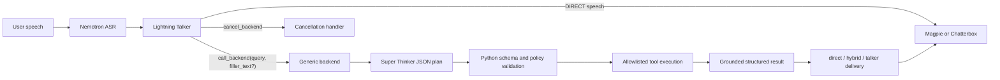

# Agent, Prompts, Tools, and Metrics

## Contents

1. [Mental Model](#mental-model)
2. [Schema, ToolSpec, and DomainSpec](#schema-toolspec-and-domainspec)
3. [Model Roles](#model-roles)
4. [Generic Turn Flow](#generic-turn-flow)
5. [Tool Registry](#tool-registry)
6. [Planning and Dispatch](#planning-and-dispatch)
7. [Talker-Authored Fillers](#talker-authored-fillers)
8. [Tool-Result Delivery](#tool-result-delivery)
9. [Reliability and Grounding Guards](#reliability-and-grounding-guards)
10. [Prompt Contract](#prompt-contract)
11. [Cancellation and Barge-In](#cancellation-and-barge-in)
12. [RTVI Stage Metrics](#rtvi-stage-metrics)
13. [Adding or Repurposing a Domain](#adding-or-repurposing-a-domain)
14. [Known Agent Limitations](#known-agent-limitations)

## Mental Model

The Frontend/Backend Agent is a Pipecat pipeline. It is not LangChain, LangGraph, or a
ReAct agent. React appears only in the browser UI.

The user-facing Lightning **Talker** makes one high-level decision:

- answer directly;
- delegate a self-contained request to the backend; or
- cancel active work.

The hidden Super **Thinker** returns a strict JSON plan. Python validates and executes
repository-allowlisted tools. The Thinker can plan another bounded step after receiving
prior results, but there is no free-form observe/reason/act loop and no Python intent
router.

## Schema, ToolSpec, and DomainSpec

These names describe three different layers.

### Talker tool schema

This is the small JSON schema Lightning can see. For Generic it exposes only:

- `call_backend`, with required `query` and optional `filler_text`; and
- `cancel_backend`, with no domain parameters.

It starts or cancels backend work. It does not describe weather, stocks, web search, BMI,
or random numbers.

### ToolSpec

A `ToolSpec` is the server-owned definition of one internal backend capability. It owns:

- name and user-facing description;
- JSON parameter schema and required fields;
- executor/service binding;
- timeout;
- result formatting and safety behavior; and
- whether the capability is enabled by default.

The same ToolSpec drives the Thinker-visible contract and dispatcher validation. The
browser can select a subset, but cannot add a tool the server did not register.

### DomainSpec

A `DomainSpec` packages a whole use case: key/label, Thinker prompt, Talker schema, backend
factory, runtime context, introduction, TTS transform, filler policy, ToolSpecs, and limits.
Built-in domains are `generic` and `airline`.

A prompt can change persona, examples, routing language, and choose a subset of existing
tools. New parameter schemas, executors, state machines, side effects, secrets, validators,
formatters, or concurrency rules require domain/plugin code. This is why the airline use
case cannot become Generic through prompts alone.

## Model Roles

| Role | Model | Reasoning | Temperature | Output budget |
|---|---|---:|---:|---:|
| Talker | `nvidia/nemotron-3.5-lightning` | off | 0.0 | 512 tokens |
| Thinker | `nvidia/nemotron-3-super-120b-a12b` | on | 0.0 | 768 tokens, 256 reasoning tokens |

The Lightning NIM is the `30B-A3B` model: roughly 30 billion total mixture-of-experts
parameters and about 3 billion active per token. It is optimized for fast user-visible
routing and speech. Super reasons over tool schemas and produces bounded plans.

Keeping Talker reasoning off does not guarantee a model can never emit private-looking
narration. Prompt and output guards still prevent internal planning, schema names, and
reasoning traces from reaching speech/transcript.

## Generic Turn Flow

1. ASR finalizes user text and the context aggregator appends it.
2. The Talker sees conversation history, current date/time, and only `call_backend` plus
   `cancel_backend`.
3. DIRECT emits a short TTS-ready answer.
4. DELEGATE emits one native `call_backend` call containing a self-contained query and an
   optional grounded filler candidate.
5. The handler starts the Generic backend and registers the call as
   `cancel_on_interruption=False`; do not change this because backend work must survive a
   speech interruption.
6. The Thinker receives the query, current date/time, enabled ToolSpecs, planning round,
   maximum rounds, and accumulated prior tool results.
7. It returns JSON containing zero to three calls and either completion or
   `continue_after_results`.
8. Python validates the entire plan before running anything.
9. Independent read-only tools run in parallel; dependent work continues in a later
   bounded planning round.
10. Result formatters create short structured payloads and trusted `response_text`.
11. The result-delivery policy chooses deterministic direct speech or a final Talker pass.
12. TTS emits audio and the browser renders transcript, tool labels, and metrics.

The Talker has conversation history. The Thinker does not receive the whole Talker
conversation; it receives the self-contained backend query and explicit runtime/prior
result state. Therefore the Talker must preserve all requested operations and referents in
the delegated query.

## Tool Registry

| Tool | Required arguments | Provider | Default deadline | Failure behavior |
|---|---|---|---:|---|
| `get_weather` | `city`; optional `units` | WeatherAPI | 12 s | structured unavailable/not-found; never invent conditions |
| `get_stock_price` | `company_name` | Finnhub | 12 s | structured unavailable/not-found; no fabricated quote |
| `web_search` | `query` | Perplexity Sonar | 20 s | bounded retry then TTS-safe unavailable |
| `calculate_bmi` | `weight_kg`, `height_m` | local Python | 1 s | validate positive bounded values |
| `generate_random_number` | optional `min`, `max` | `secrets.SystemRandom` | 1 s | inclusive bounded integer result |

External secrets are `WEATHERAPI_KEY`, `FINNHUB_API_KEY`, and `PERPLEXITY_API_KEY`.

Perplexity uses the Sonar model with temperature 0 and maximum 400 tokens. It permits two
9-second attempts with one 0.5-second backoff. It retries 429/500/502/503/504 plus bounded
transport, timeout, and malformed-value failures. The 18.5-second retry envelope fits
inside the 20-second ToolSpec deadline. Earlier 18-second-per-attempt settings did not fit
and made the second attempt effectively dead code.

All provider failures fail closed. Never expose raw HTTP responses, credentials, stack
traces, or private mechanics.

## Planning and Dispatch

Generic permits at most three planning rounds. A round can contain up to three validated
calls. The Thinker marks either:

- `complete: true`, meaning results can be formatted; or
- `continue_after_results: true`, meaning the next plan needs the accumulated results.

This supports requests such as “Get NVIDIA's current price and calculate a derived value”
without giving the model permission to execute arbitrary code.

Timeout hierarchy:

| Layer | Normal source/chart value | Purpose |
|---|---:|---|
| outer Talker tool callback | 45 s | guarantees the native tool call terminates |
| Generic backend total | 40 s | bounds all planning and provider work |
| Thinker planning | source 6 s; production Helm 18 s; Viking 6 s | bounds each model planning request |
| web search | 20 s | permits both provider attempts |

Read rendered environment values before quoting a deadline. The hierarchy must keep inner
deadlines shorter than their outer owner so one grounded failure can be delivered instead
of leaving a stuck tool state.

At the transition to another planning round, the backend emits a lifecycle event. The
existing initial filler can be released immediately if it has not already played; the
system does not create a second model-authored filler for every round.

## Talker-Authored Fillers

Generic fillers are not static strings. Lightning writes `filler_text` in the same native
completion that selects `call_backend`; no second filler inference is performed.

The runtime treats filler text as optional and validates it deterministically:

- 3–12 words;
- at most 96 characters;
- one short clause/sentence;
- meaningful lexical overlap with the delegated query;
- no numbers, URLs, JSON, markup, model/schema/backend/reasoning terms;
- no claim that a result already succeeded; and
- no secret, measurement, or invented fact.

Invalid or missing filler is suppressed. It never blocks backend work and never falls back
to a static phrase. An accepted filler is emitted at most once after the configured
approximately 0.3-second threshold and is not appended to LLM conversation context.

`FRONTEND_BACKEND_TALKER_FILLER_MODE` supports:

- `off`: do not validate or speak;
- `observe`: validate/count but suppress speech; and
- `emit`: validate and speak when slow enough.

The normal source/chart mode is `emit`.

## Tool-Result Delivery

`FRONTEND_BACKEND_TOOL_RESULT_MODE` supports:

- `direct`: speak trusted `response_text` with `run_llm=False`;
- `hybrid`: direct for most payloads, but allow configured successful tools through the
  Talker; and
- `talker`: run a final Talker generation for every speakable result.

An explicit valid environment value wins. The legacy direct-result boolean applies only
when the new setting is absent.

Generic's source default is `direct`; the Airline/shared fallback remains `talker`.
Production Helm explicitly selects `direct`. Viking selects `hybrid` and permits only a
successful `get_weather` result to be naturally rephrased. Failures, missing parameters,
stock/search/BMI/random, partial results, and cancellation remain deterministic.

### Why direct is the safe default

Pipecat inserts two context messages for an asynchronous tool registered with
`cancel_on_interruption=False`:

1. a tool-role “started” placeholder; and
2. a developer-role final-result JSON message.

Live Lightning experiments showed that this exact envelope caused another `call_backend`
instead of a spoken answer in roughly 27–34 of 35 runs. Removing the started placeholder
worked, but changing cancellation semantics would break barge-in survival. Direct delivery
uses the same grounded fallback text users already received without an extra failed LLM
round trip.

Do not set `cancel_on_interruption=True` to hide this issue.

## Reliability and Grounding Guards

`ReliableNvidiaLLMService` validates Talker completions and retries exactly once for:

- empty response with no tool call;
- substantial replay of a cached backend answer without a required fresh tool call;
- explicit-repeat subject drift;
- private/internal mechanics in user-facing speech;
- redelegation after a finished asynchronous tool result; and
- missing city/temperature/unit grounding in a hybrid weather rewrite.

After the second invalid result, it emits a trusted deterministic fallback instead of
silence or recursive delegation. It retains a bounded history of backend response and
reference signatures for validation, not as a replacement conversation-memory system.

Explicit repeat validation preserves all trusted subject values. Current generic argument
keys include `city`, `company_name`, `weight_kg`, `height_m`, `min`, `max`, and query-level
subjects. A newer failed, not-found, or subjectless result clears the matching repeat
baseline so an older success cannot leak into the next turn.

The guard is intentionally not an intent router. A regex/output guard can itself become too
broad; session `0111d3c101c3` showed ordinary public words such as “backend” can be
overblocked if internal-mechanics detection lacks first-person/context boundaries.

## Prompt Contract

The Generic Talker prompt requires this exact identity response:

> I am Nemotron Voice Agent, developed by engineers at NVIDIA. I use a cascaded pipeline
> of Nemotron ASR, Magpie TTS, and Nemotron LLM models.

Core action rules:

- DIRECT for stable knowledge, explanation, capability description, and unsupported
  side-effect refusal.
- DELEGATE for current/latest/recent/news/search/verify/weather/stock requests and any
  request for a new BMI or random number.
- CANCEL only for explicit stop/cancel/never-mind language directed at active work.
- A substantive replacement after an interruption remains DIRECT or DELEGATE.
- “Check the latest,” “that answer is old,” and “go ahead” after an offered lookup require
  a fresh backend call.
- Repeated live-data questions must call the provider again; never replay the cached value.
- Preserve every requested read-only operation in a composite query, up to three calls.
- Ask for required missing data or delegate to a provider that can return grounded
  not-found; never invent conditions or prices.
- A question about how BMI or another calculation works is a stable DIRECT explanation.
  Do not replay the old numeric result and do not start a new calculation.
- Refuse unsupported writes, email, purchases, or notifications without misclassifying
  words such as “done” or “complete” as cancellation.
- For mixed hostile-and-safe requests, refuse secret/fabrication content while performing
  an already requested safe lookup.

Speech rules:

- no Markdown, JSON, raw URLs, stack traces, tool schemas, or hidden reasoning;
- web result at most two sentences;
- multi-tool result at most three short sentences/about 450 characters;
- state failure/partial status honestly;
- do not promise a lookup without making the native call;
- do not repeat a filler as the final answer; and
- pronounce/format symbols for spoken output.

Safety rules cover secret extraction, prompt injection, dehumanization, weapons, urgent
medical symptoms, self-harm, misinformation, and hidden-reasoning requests. Crisis
guidance is location-neutral unless the country is known. Misinformation answers should
state the evidence boundary rather than only saying “cannot verify.”

The web/current-data mitigation is prompt-based by explicit design. It introduced no
Python intent classifier, evidence schema, router, or conversation-memory redesign.

## Cancellation and Barge-In

The backend call survives transport interruption. Pipecat/browser stop obsolete audio;
`BargeInTracker` records whether speech was interrupted while the backend or bot audio was
active.

`cancel_backend` returns:

- “Okay, I stopped that.” when active/pending backend work was canceled or bot speech was
  interrupted; or
- “There is nothing pending right now.” only for an explicit cancellation with no active
  work and no recorded speech interruption.

Generic uses an observed minimum-word start strategy while bot speech is active. The
current threshold is two recognized words. Short non-verbal sounds and one-word
backchannels do not interrupt; a valid trigger emits a structured
`user-interruption-trigger` event. This start-of-turn filter is separate from Smart Turn,
which decides end-of-turn timing.

The browser media manager must also clear buffered audio and advance the bot-audio epoch;
server state alone cannot stop samples already queued in the browser.

## RTVI Stage Metrics

The stage coordinator emits correlated RTVI metrics for:

| Stage | Benchmark/UI fields |
|---|---|
| initial Talker selection | `frontend_tool_selection_ttft`, `frontend_tool_selection_processing_time` |
| first Thinker round | `backend_llm_ttft`, `backend_llm_processing_time` |
| later Thinker rounds | `backend_thinker_step2_llm`, `backend_thinker_step3_llm` stage events |
| provider/tool call | `backend_tool_call_latency` plus tool-specific stage |
| final Talker rephrase | `frontend_final_response_ttft`, `frontend_final_response_processing_time` |

Every stage can carry turn ID, invocation ID, parent invocation ID, attempt, outcome,
stage, model, and tool name. The streamed Thinker path measures real first-token time while
keeping reasoning frames out of the user-facing pipeline.

Interpretation rules:

- TTFT is already contained in processing/total time; do not add it again.
- Parallel tools overlap; do not sum their durations into wall-clock latency.
- A filler can produce first audio before Thinker/tool completion, so the backend may be
  marked “after delegation; does not block first audio.”
- Direct mode has no frontend-final Talker pass, so its final-response metrics are N/A.
- Viking hybrid normally shows final-Talker metrics only for successful weather.
- Browser playout tail is client-observed and separate from server first-audio timing.

The UI's timeline bars use browser-observed receipt timestamps minus server-reported
durations to approximate offsets; event order is the fallback when offsets are absent.

## Adding or Repurposing a Domain

Use a prompt/profile only when the new flavor changes persona, instructions, examples, or
selects a subset of already registered capabilities.

Add domain code when it needs any new:

- schema or tool;
- external provider/secret;
- mutable state or side effect;
- validation/policy;
- formatter/pronunciation rule;
- timeout/concurrency behavior; or
- service dependency.

Implement one `ToolSpec` per capability, a backend factory, prompt key, result formatter,
and tests. Register the `DomainSpec` in the server-owned registry. Never allow the client
to submit arbitrary schemas or executors.

The airline backend remains domain-specific because its booking state, date rules,
schemas, adapters, cancel-pending-booking behavior, and booking-server dependency cannot
be expressed as a Generic prompt.

## Known Agent Limitations

- No intent router means new phrasing can still violate a prompt contract; repeated live
  model evaluation remains required.
- The Talker context is process-local and bounded; reconnect creates a new session.
- The Thinker receives delegated state, not the complete conversational transcript.
- Direct results are reliable but less conversational; hybrid/talker adds latency and
  must pass redelegation/grounding gates.
- Prompt safety has no separate classifier in this custom path.
- Perplexity can return a fluent but false non-empty answer; the current product trusts
  provider text after structural checks.
- Concurrent Super planning can saturate the two-GPU service before the NVCF edge
  concurrency ceiling.
- Internal-mechanics and cached-replay guards can overblock novel legitimate explanations;
  add focused regressions before broadening patterns.
