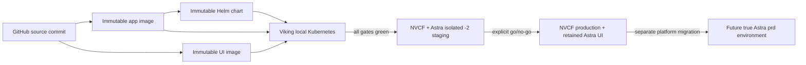

# Deployment Flow

## Contents

1. [Deployment Planes](#deployment-planes)
2. [Artifact Lineage](#artifact-lineage)
3. [Secrets](#secrets)
4. [Viking Qualification](#viking-qualification)
5. [NVCF and Astra Staging](#nvcf-and-astra-staging)
6. [Production Promotion](#production-promotion)
7. [Readiness and Smoke Checks](#readiness-and-smoke-checks)
8. [Rollback and Capacity](#rollback-and-capacity)
9. [Operational Status Reporting](#operational-status-reporting)
10. [Deployment Gotchas](#deployment-gotchas)

## Deployment Planes

The project uses three sequential planes:



- **Viking:** local Kubernetes qualification with local UI/proxy and existing inference
  services where possible.
- **Isolated staging:** a separately named NVCF function and Astra app, historically using
  a `-2` suffix, so it cannot affect the retained live UI.
- **Production:** the retained serving NVCF function and Astra app.
- **True Astra production:** an Astra `prd` cluster, role, Vault path, ingress, and NSPECT
  boundary. A UI in Astra `stg` that points to a production NVCF function is not a true
  Astra production deployment.

Never skip Viking because an image built successfully. Never call isolated staging
production because it uses production-like NIMs.

## Artifact Lineage

Build all artifacts from a clean committed archive. Preserve this chain:

```text
branch + full source SHA
    -> app image tag + digest
    -> UI image tag + digest + embedded build timestamp
    -> Helm chart version + package checksum + NGC upload status
    -> Viking release revision
    -> NVCF function version/deployment
    -> Astra app revision and Vault target
    -> SQA report
```

Use immutable digests for qualification and promotion. Do not rebuild the same version tag
between environments.

Separate commits where practical:

1. tests and preserved regression evidence;
2. behavior change;
3. documentation;
4. immutable app/UI/chart version bump.

Run secret scans before and after the release bump.

## Secrets

Record secret names, never values.

### Viking

Use namespace-scoped Kubernetes Secrets referenced by `nvcf_helm/values-viking.yaml`.
The checked-in values contain selectors only.

Typical groups are:

- registry/model and app NVIDIA credentials;
- Perplexity, WeatherAPI, and Finnhub tool credentials; and
- capture/NGC credentials.

Ensure every app replica receives the same provider secrets. A tool working on one replica
is not proof that the Deployment injects the key everywhere.

### NVCF

Every new function version needs the complete secret set. NVCF mounts them at
`/var/secrets/secrets.json`; it does not inherit a previous function version's values.

Required names are documented in
[Runtime Architecture](runtime-architecture.md#trust-and-secret-boundaries).

Use a dedicated `NGC_API_KEY` for model access and capture publication. Keep the NVCF
invocation key separate where possible.

### Astra

Use Fusion-managed Vault values for:

- NVCF HTTP host;
- NVCF function ID; and
- invocation-capable NVIDIA API key.

Astra nginx injects those values into upstream requests. The UI image does not contain
them. Load the installed `fusion` skill before any Fusion, Vault, or Astra mutation.

After Fusion login, verify authentication and target environment before deploying. An
expired token blocks accurate consumer checks; do not guess which values file is unused.

## Viking Qualification

### Preflight

1. Verify the branch and clean commit.
2. Verify chart `version`, `appVersion`, app tag, and Viking app tag agree.
3. Render and lint Helm.
4. Confirm required namespace Secrets exist without printing their values.
5. List current pods, images, UIDs, and readiness.
6. Preserve the previous app/UI rollback.
7. Build or load only the new app and UI images required by the change.

### Deploy

Render the complete chart using `nvcf_helm/values-viking.yaml`. For app-only changes,
ensure the release rolls only the five app replicas and prewarmer. Preserve ASR, Lightning,
Super, Omni, Magpie, Chatterbox, Redis, and SeaweedFS pod identities.

Run the UI locally with the matching immutable UI image and proxy it to the Viking service.
Bind to `0.0.0.0` only when the user requests remote access. If using a public or secure
tunnel, expect the tunnel provider's trust warning or access challenge unless explicitly
configured. Do not mistake a tunnel authentication screen for application auth.

### Smoke

Require:

- five of five app replicas Ready;
- model pods unchanged when not in scope;
- `/health`;
- `/api/deployment`;
- `/api/session-config`;
- WebSocket connection;
- visible UI build version/date;
- Generic identity speech;
- one weather and one stock call;
- Magpie speech with dictionary-load evidence;
- Chatterbox speech with no dictionary; and
- Omni voice plus media when changed.

Then run the full gates in
[SQA Findings and Gates](sqa-findings-and-gates.md).

A failed Viking candidate never advances to NVCF/Astra.

## NVCF and Astra Staging

Use isolated names that cannot be confused with the retained live deployment. The project
historically uses `nemotron-voice-agent-2` for NVCF and an Astra app with the same `-2`
identity.

1. Create a new NVCF function version with the exact qualified chart artifact.
2. Supply the full function-version secret set.
3. Keep the retained production function untouched.
4. Wait for NVCF control-plane `ACTIVE`, then check every instance/pod and model service.
5. Update the isolated Astra Vault target to the new function.
6. Deploy the exact qualified UI digest.
7. Verify `/config.js` timestamp and `/api/deployment` through the Astra URL.
8. Repeat the complete real-audio, concurrency, webcam, capture, failure, guardrail,
   reconnect, and pronunciation matrices through Astra.
9. Record a staging SQA report and request explicit go/no-go approval.

NVCF function instance pod lists and logs can be obtained through the NVCF/Fusion tooling
after authentication. Use those logs to distinguish image pull, scheduling, startup,
readiness, and runtime failures.

Do not use the isolated staging UI for the retained production audience. Confirm the
Astra Vault function ID rather than relying on the hostname.

## Production Promotion

Promote only the exact staging-qualified app, UI, and chart digests.

1. Create a new production NVCF function version without removing the serving version.
2. Supply all function-version secrets again.
3. Wait for the replacement to become `ACTIVE`.
4. Verify pod/model readiness, `/health`, `/api/deployment`, WebSocket, one Generic tool
   turn, one Omni turn, TTS, and capture status.
5. Point the retained Astra UI Vault target to the new function and deploy the exact UI
   digest.
6. Run production smoke and the required full post-deploy SQA.
7. Keep the prior production version as rollback for 24 hours.
8. After healthy monitoring, remove inactive versions but retain one known-good rollback.

If eight-H100 capacity prevents overlap, stop. Removing the serving deployment can cause
downtime and requires explicit user authorization. That authorization does not permit a
partial pipeline unless the user separately approves it.

## Readiness and Smoke Checks

Treat these signals independently:

| Signal | Meaning |
|---|---|
| image/chart upload complete | artifact exists |
| Helm render/lint pass | manifests are structurally valid |
| NVCF `ACTIVE` | control plane accepted the deployment |
| pod Ready | Kubernetes probe passes |
| `/health=200` | FastAPI responds |
| `/api/deployment` | app registry and catalog resolve |
| `/api/session-config` | selected model services pass deep readiness |
| WebSocket `101` and audio | real streaming path works |
| SQA pass | user behavior meets the tested gate |
| NGC capture version | one exact session archived |

`nimReadyImmediate=true` can let model pods appear Ready before full model health. Do not
promote on control-plane state alone.

The prewarmer must use the same Omni served alias as the app catalog and vLLM. Omni JSON
guided decoding should be warmed with `response_format=json_object` so the first real
Speaker request does not pay grammar compilation.

## Rollback and Capacity

Rollback units are immutable NVCF function versions plus the matching Astra UI/Vault
target. Keep their source SHA, chart checksum, image digests, and secret names documented.

An in-place app rollout uses `Recreate` and can drop active WebSockets. Prefer a new function
version. Redis cannot move a live socket to another pod.

When reverting:

1. identify the last fully qualified exact artifacts;
2. restore the NVCF function version;
3. restore the Astra Vault function target and matching UI;
4. verify no stale NVCF request cookie survives;
5. run smoke and the relevant regression; and
6. preserve the rejected candidate and report.

## Operational Status Reporting

A complete status report has seven independent lines:

1. source branch and full commit;
2. app/UI/chart artifact identities;
3. Viking deployment and gate status;
4. NVCF staging function version and state;
5. Astra staging revision, URL, and target function;
6. production NVCF and Astra state; and
7. passed, failed, and pending SQA gates plus rollback availability.

Avoid “good,” “up,” or “passed” without scope.

## Deployment Gotchas

- NVCF WebSockets require the streaming gateway, not the HTTP invocation host.
- An NVCF function version does not inherit secrets.
- A model pod can exist but remain absent from the UI if the curated Helm registry does not
  advertise its service ID.
- An Astra UI can be new while pointing to an old function, or old while pointing to a new
  function. Verify both UI timestamp and function ID.
- OCI RWO block volumes are zone-locked and historically left pods in
  `ContainerCreating`; current caches/staging use `emptyDir`.
- The abandoned session-affinity router and StatefulSet failed on NVCF. Redis and
  SeaweedFS replaced that design.
- A cross-repository image tag/push can retain subscription-gated layer mounts. Verify that
  NVCF can actually pull and create the container.
- Lightning requires valid tool and reasoning parser flags. Invalid profile selectors or
  hardcoded GPU visibility can crash-loop it.
- H100 scheduling capacity can prevent side-by-side production versions.
- NVCF `ACTIVE`, `/health`, and a warm prewarmer do not prove tool credentials, webcam,
  capture, or audio quality.
- A browser player sample-rate mismatch sounds like a TTS model regression but requires
  only a UI fix.
- Do not redeploy a TTS NIM for an application-level pronunciation dictionary change.
