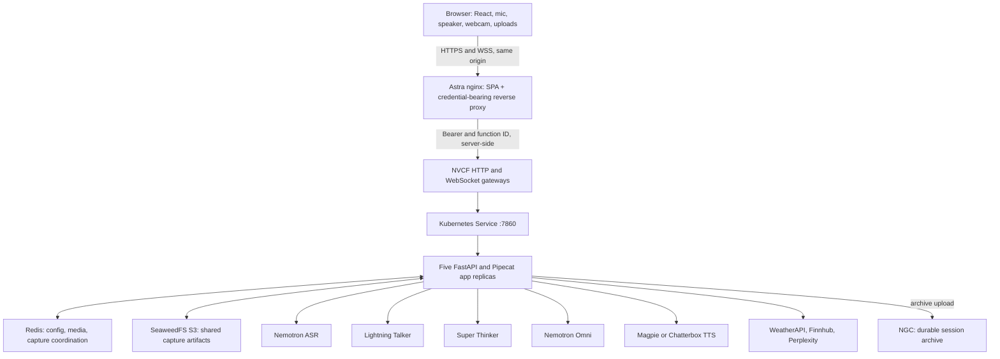
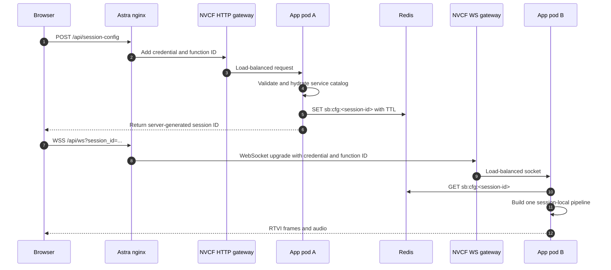
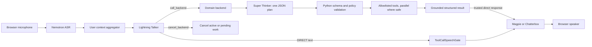
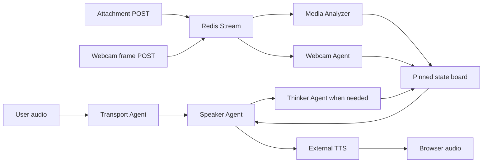

# Runtime Architecture

## Contents

1. [End-to-End Topology](#end-to-end-topology)
2. [Browser and Astra Boundary](#browser-and-astra-boundary)
3. [NVCF and Kubernetes Topology](#nvcf-and-kubernetes-topology)
4. [Session Start and Routing](#session-start-and-routing)
5. [Generic Frontend/Backend Turn](#generic-frontendbackend-turn)
6. [Omni Subagents Turn](#omni-subagents-turn)
7. [Concurrency Model](#concurrency-model)
8. [Redis Design](#redis-design)
9. [SeaweedFS and Session Capture](#seaweedfs-and-session-capture)
10. [Barge-In and Turn Detection](#barge-in-and-turn-detection)
11. [TTS and Pronunciation](#tts-and-pronunciation)
12. [Trust and Secret Boundaries](#trust-and-secret-boundaries)
13. [Readiness and Observability](#readiness-and-observability)

## End-to-End Topology



Astra and NVCF are different deployment planes. Astra serves the UI and proxies requests.
NVCF hosts the application and inference workloads.

## Browser and Astra Boundary

The browser receives only public runtime values, including the deployment timestamp,
visible examples, demo limits, and feature flags. It must never receive the NVCF invocation
key or provider keys.

Astra nginx routes:

| Browser path | Upstream |
|---|---|
| `/` and assets | local React build |
| `/api/ws` | NVCF streaming gateway with WebSocket upgrade |
| `/api/*` and `/health` | NVCF per-function HTTP invocation gateway |
| `/feedback` | optional private feedback upstream |

nginx injects `Authorization` and `function-id` headers. It strips inbound cookies and
upstream `Set-Cookie` so an obsolete NVCF affinity/request cookie cannot produce a later
dead-session `404` or WebSocket `1006`.

The UI image is function-agnostic. Astra Vault values select the NVCF host and function.
Changing a Vault target can repoint the same immutable UI image without exposing the key.

## NVCF and Kubernetes Topology

The chart uses a normal `Deployment` with five app replicas and a normal ClusterIP Service.
No session-affinity router, headless Service, or StatefulSet remains.

The model topology is:

- one ASR deployment;
- one Lightning deployment;
- one two-GPU Super deployment;
- one Omni vLLM deployment;
- one Magpie deployment;
- one Chatterbox deployment;
- one prewarmer;
- one Redis deployment;
- one SeaweedFS deployment; and
- five app replicas.

Only port `7860` is exposed through NVCF. Model, Redis, and SeaweedFS services remain
cluster-internal.

## Session Start and Routing



The config POST and WebSocket can land on different replicas. Redis makes the sanitized
session configuration available to both.

`POST /api/session-config` must validate the example, filter unknown fields, hydrate
server-owned service details, check selected local service readiness, mint a short random
session ID, and store the configuration locally plus in Redis.

## Generic Frontend/Backend Turn



This is not a ReAct observe/replan loop. The Thinker emits one bounded plan. Python
validates and executes it. The Talker does not see weather, stock, search, BMI, or random
schemas.

The Talker selects exactly one mode:

- **DIRECT:** produce one short, TTS-ready response.
- **DELEGATE:** emit one native `call_backend` call.
- **CANCEL:** emit one native `cancel_backend` call.

The runtime retries an empty, cached-replay, or explicit-repeat subject-drift completion
exactly once with an internal correction. If the retry remains invalid, it emits a
deterministic spoken fallback. The runtime never chooses a domain tool itself.

Successful grounded `response_text` can bypass a second Talker inference. This prevents
duplicate speech and repeated delegation after a completed asynchronous result.

Code-authored fillers are deterministic:

| Capability | Filler |
|---|---|
| Weather or forecast | “Let me check the latest weather.” |
| Stock or share price | “Let me look up the latest price.” |
| Web search, news, or research | “Let me look that up.” |
| BMI | “Let me work that out.” |
| Composite request | “Let me check those details.” |
| Other delegated work | “Let me check that.” |

## Omni Subagents Turn

The Omni Transport Agent owns audio transport and delegates to workers:



Ownership rules prevent one worker from inventing another worker's state. The Transport
Agent dispatches and acknowledges media. The Speaker uses the pinned board to ground speech.

The first webcam observation must describe a concrete scene. Before a baseline exists,
`No notable change.` is invalid and the controller waits for a later frame rather than
spinning. After a baseline exists, no-change preserves the last scene. Low-resolution
frames drive background observation; a tokenized request authorizes one high-resolution
capture upload.

## Concurrency Model

Five app replicas provide process isolation and CPU capacity. Each WebSocket creates its
own pipeline, context, and worker graph on the accepting process.

| State | Store | Cross-replica |
|---|---|---:|
| WebSocket and pipeline processors | app process | no |
| LLM conversation context | app process | no |
| sanitized session config | local cache plus Redis | yes |
| attachments and webcam frames | Redis Streams | yes |
| capture flags and finalizer lock | Redis | yes |
| capture audio, log, transcript | SeaweedFS | yes |
| final archive | NGC | durable |

Redis does not make a live socket movable. If the pod holding a socket dies, the session
ends and the client must reconnect with a new session.

NVCF `maxRequestConcurrency` is an edge admission value, not end-to-end capacity. Capacity
is bounded by app event loops, model sequence limits, one-replica model services, Redis
memory, SeaweedFS throughput, external quotas, browser audio, and capture executors.

## Redis Design

Redis runs without persistence because it is live coordination state. The chart currently
uses a 256 MiB `allkeys-lru` policy. Representative keys are:

| Key | Meaning |
|---|---|
| `sb:cfg:<sid>` | sanitized session configuration |
| `sb:wc:<sid>` | webcam frame stream |
| `sb:att:<sid>` | attachment stream |
| `sb:capreq:<sid>` | valid high-resolution capture request token |
| `cap:<sid>` | pipeline, consent, attempt, and error state |
| `cap:lock:<sid>` | token-owned finalizer lock |

Media listeners use blocking `XREAD` from `0`, a block timeout shorter than socket timeout,
and bounded retry. Starting from `0` prevents missing a frame uploaded before the listener
started.

When Redis is configured, the NVCF app entrypoint waits for `PING` before Python starts.
This prevents one of five replicas from silently falling back to unsafe in-memory state.

## SeaweedFS and Session Capture

SeaweedFS is an S3-compatible shared staging store. It is not the durable archive. The
default `emptyDir` avoids zone-locked OCI block-volume failures but loses in-flight source
objects if the SeaweedFS pod restarts.

The object namespace is:

```text
sessions/<sid>/session.log
sessions/<sid>/transcript.txt
sessions/<sid>/audio/asr_000.wav
sessions/<sid>/audio/tts_000.wav
```

Capture requires two independent signals:

1. pipeline completion, after logs and audio are stored; and
2. browser consent/reporting, including the rendered transcript.

A shared coordinator keeps one in-flight browser request per session, waits up to 1.5
seconds for an HTTP 2xx acknowledgement during graceful teardown, retries once, and uses
`keepalive` for page-close fallback. `captureFlushed=true` means the server acknowledged the
POST; it does not by itself mean NGC upload completed.

After both signals exist, one replica obtains a token-owned Redis lock, reads SeaweedFS
objects, creates a temporary tarball, and uploads an NGC resource version named for the
session ID. Successful upload clears source data and state. Retryable NGC failures retain
diagnostic state and source objects. Consented sessions with no artifacts remain
diagnosable rather than being finalized as success.

Verify a capture end to end by correlating the UI session ID, Redis state, SeaweedFS prefix,
app log, capture status, and an NGC `UPLOAD_COMPLETE` version.

## Barge-In and Turn Detection

Smart Turn is enabled by default. Silero voice activity detection (VAD) detects speech
start, while the local Smart Turn analyzer decides end of turn with a 1-second silence
fallback. Generic Frontend/Backend uses a 0.5-second VAD finalization delay to reduce split
utterances while retaining Smart Turn. Setting `USE_SILERO_VAD_TURN_DETECTION=true`
disables Smart Turn and uses pure Silero timeout behavior.

Barge-in has two separate responsibilities:

- Pipecat and the browser media manager stop and clear obsolete audio.
- The session-local tracker records whether the user started while bot speech was active.

A substantive replacement request remains DIRECT or DELEGATE. It must not be discarded as
cancellation. An explicit stop after speech-only interruption can acknowledge, “Okay, I
stopped that,” even if the backend task already completed. “There is nothing pending right
now” is reserved for a real cancellation request with no active work and no interrupted
speech.

Barge-in proof requires both a registered replacement turn and an acoustic cutoff
measurement. A correct next answer alone does not prove old buffered TTS stopped promptly.

## TTS and Pronunciation

The browser must read the server-advertised input and output sample rates before creating
the WebSocket transport. Nemotron ASR input is typically 16 kHz; Magpie output is 22.05 kHz.
Hardcoding the player to 16 kHz slows and lowers the pitch of 22.05 kHz audio.

The versioned pronunciation registry stores:

- grapheme and aliases;
- ARPAbet for review and portability;
- IPA for the NVIDIA TTS NIM request; and
- category metadata.

`load_ipa_dictionary` accepts the rich registry and legacy flat IPA files. It returns IPA
only for Magpie models and no dictionary for Chatterbox. The TTS NIM itself is unchanged.

Chatterbox has a per-synthesis duration/length cap. The application uses short chunks,
about 240 dense characters, rather than changing the Chatterbox deployment.

Independent ASR is a detector for pronunciation issues, not a final judgment. Human-listen
before promoting or removing mappings.

## Trust and Secret Boundaries

The browser is untrusted and receives no upstream secret. Astra nginx holds the NVCF
invocation credential. NVCF mounts function-version secrets in
`/var/secrets/secrets.json`; the app entrypoint exports named values.

Required secret names include:

- `NVIDIA_API_KEY`;
- `NGC_API_KEY`;
- `PERPLEXITY_API_KEY`;
- `WEATHERAPI_KEY`;
- `FINNHUB_API_KEY`; and
- `SESSION_CAPTURE_NGC`.

Every NVCF function version must receive the complete set again. Do not assume inheritance.
Use a dedicated NGC key for registry upload rather than relying on the invocation key.

Redis and SeaweedFS have no public ingress. Their current security relies mainly on
namespace and network isolation. Treat this as an explicit deployment boundary.

## Readiness and Observability

`/health` proves FastAPI responsiveness only. NVCF `ACTIVE` proves control-plane rollout,
not functional model readiness. Verify:

- `/api/deployment` for advertised examples and models;
- `/api/session-config` for deep selected-service readiness;
- a real WebSocket session;
- at least one tool turn;
- Omni media when in scope;
- `/api/session-capture/status`; and
- one NGC-correlated capture when capture is in scope.

The prewarmer directly warms ASR, Super, Omni guided JSON, Magpie, and Chatterbox. The
recorded chart has no explicit Lightning warm target, so first-use Lightning latency remains
a known gap.

OpenTelemetry/Phoenix is disabled in the custom NVCF topology. Correlate with the short
session ID in browser state, app logs, Redis, SeaweedFS, and NGC.
